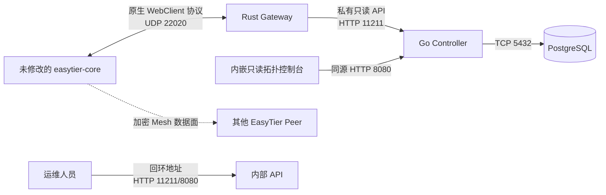

# 🌐 NexusTier

> **Orchestrating the Next-Generation Zero-Trust Mesh Network.**  
> **连接星穹，智驭网络 —— 下一代现代零信任 SDN 编排系统。**

[](LICENSE)
[](https://github.com/EasyTier/EasyTier)

---

## 📖 项目定位 (Project Status)

**NexusTier** 的目标是成为面向 **EasyTier** 的开源零信任 SDN 控制器与 SD-WAN
编排系统。当前仓库交付的是第一阶段的**安全接入、遥测持久化与只读拓扑控制台**，不是完整的
零信任或 SD-WAN 管理产品。

架构边界是“控制面集中编排，数据面由 EasyTier Mesh 自收敛”。NexusTier 不代理
EasyTier 数据包，不替代 EasyTier 的 NAT 穿透、加密隧道、路由收敛和数据转发。

---

## ✅ 当前可用能力 (Available Today)

*   **原生 EasyTier 安全接入**：兼容 EasyTier v2.6.4 UDP WebClient，支持 Noise + AES-GCM、安全心跳、共享准入 Token 和 Machine ID 重连保护。
*   **实时拓扑遥测**：反向采集 Node、Peer、Route、RTT、丢包、流量和 Stats，提供部分成功、结构化错误、单飞和有界采集。
*   **版本化控制面契约**：Rust Gateway 生产 `nexustier.topology.v1`，Go Controller 严格校验并消费同一 Schema/fixture。
*   **PostgreSQL 持久化**：幂等保存 Machine、Instance、Node、当前 Peer 链路、指标样本和采集错误，保护乱序和局部失败状态。
*   **持久化拓扑查询**：Controller 从规范化表提供 Machine、Instance、Node、Peer、collection 新鲜度和结构化错误的稳定分页 API。
*   **内嵌拓扑控制台**：Controller 在 `8080/` 提供响应式只读 Web UI，展示连通图、机器清单、链路指标和 collection 健康。
*   **指标保留**：默认保留 30 天指标样本和原始 payload，后台分批清理并保留 collection 元数据、错误与 SHA-256 幂等指纹。
*   **内部运维接口**：Gateway 提供会话和实时拓扑 API；Controller 提供健康、持久化拓扑、摄取和保留状态 API。
*   **容器交付**：GitHub Actions 构建、签名并发布 Gateway 与 Controller 镜像；仓库提供 PostgreSQL 三服务 Compose 编排。

### 当前不提供

*   经过认证、可直接公网暴露的多租户 Web UI 或公开 REST/WebSocket API。
*   OIDC、RBAC、设备级身份、租户隔离或 API 认证。
*   IPAM、网络创建、配置下发、ACL/防火墙策略编译。
*   SSH/RDP 准入、Redis 事件发布、多 Controller 协调或高可用编排。
*   历史指标查询/图表、PostgreSQL 分区和长期聚合压缩策略。

当前部署和操作见
[端到端部署指南](docs/current-deployment-guide.zh-CN.md)与
[用户教程](docs/current-usage-guide.zh-CN.md)。

## 🎯 产品目标 (Planned Capabilities)

*   **📊 全球拓扑遥测 (Global Topology Telemetry)**
    *   基于 IP 离线库自动进行全球节点地理定位。
    *   提供炫酷的 2D/3D 全球资源大屏，实时渲染 P2P 直连（实线）与中继转发（虚线）路径，动态显示物理延迟与带宽。
*   **🔑 零信任免密准入 (Passwordless ZTNA)**
    *   **免密安全 SSH**：Agent 托管极轻量 SSH 进程，基于控制器统一身份校验（RBAC），支持免密直接登录与 MFA 网页二次质询。
    *   **免密 Windows RDP（黑科技）**：在客户端 Agent 中集成虚拟智能卡驱动（UMDF/KSP），通过 RDP 智能卡通道重定向（SCARD），实现无密码/扫码一键登录远程 Windows 桌面。
*   **🛡️ 声明式有状态防火墙 (Stateful ACL & Tags)**
    *   摒弃复杂的 JSON 手写规则，提供对非专业人员极度友好的“安全标签（Tags）”防火墙。
    *   控制器在后台自动将策略“翻译”为 IP/CIDR 与中继转发链规则，实现毫秒级安全隔离。
*   **🚄 多协议高可用热备 (Multi-Protocol Failover)**
    *   支持在同一条链路上并行配置 WireGuard (UDP) 与 WSS (TCP) 双通道。
    *   物理网络波动时，数据面在毫秒级内零感知切换通道，提供电信级的防封锁与网络抗震能力。
*   **☁️ 零摩擦统一登录 (Zero-Touch Provisioning)**
    *   Agent GUI 支持主流企业级 OIDC / OAuth2（飞书、企业微信、Okta 等）扫码一键登录。
    *   自动下发网卡配置与 IP 分配（IPAM），实现小白级“零配置”快速入网。

---

## 🏗️ 当前架构 (Current Architecture)



---

## 🛠️ 技术栈 (Tech Stack)

*   **控制面遥测摄取 (Control Plane)**: Go / `net/http` / pgx / PostgreSQL
*   **协议转换层 (Protocol Gateway)**: Rust / Tokio / Protobuf
*   **客户端与数据面 (External)**: 未修改的 EasyTier v2.6.4；仓库当前不包含 NexusTier Agent

---

## 🚀 当前实现 (Current Implementation)

第一阶段的 Rust 原生接入网关已落地：

*   兼容 EasyTier `v2.6.4` 原生 UDP WebClient 协议，默认监听 `22020/UDP`。
*   支持 Noise + AES-GCM 安全配置通道，不修改 `easytier-core` 客户端代码。
*   使用 Machine ID 维护并发内存 Session Pool，安全处理断线、重连与连接替换。
*   只允许 Noise + AES-GCM 安全重连注册，可选校验共享准入 Token，并禁止会话内切换 Machine ID。
*   通过原生双向 RPC 反向采集 Node、Peer、Route、RTT、流量和 Stats 指标。
*   提供 `nexustier.topology.v1` JSON Schema、固定跨语言 fixture、采集 ID、分层观测时间和结构化局部错误。
*   在 `127.0.0.1:11211` 暴露只读 `/healthz`、`/readyz`、`/v1/sessions` 和 `/v1/topology` API。
*   提供非 root 多阶段容器镜像，不需要 TUN 权限或额外 Linux capabilities。

Go 控制器遥测摄取基础可作为完整遥测链路运行：

*   严格消费共享的 `nexustier.topology.v1` 契约。
*   提供 PostgreSQL migrations 与 Machine、Instance、Node、Peer、Metric、Error 规范化模型。
*   使用单事务、`collection_id` 和时序门控实现幂等摄取、乱序保护与局部失败保留。
*   使用超时、抖动和禁止重叠的轮询 worker，并暴露健康、就绪、摄取与保留状态 API。
*   从规范化表提供 `GET /v1/topology`，支持 active、Machine UUID、UUID cursor 和 limit 过滤。
*   内嵌无外部运行时依赖的拓扑控制台，并对页面和 JSON API 设置 `no-store` 与安全响应头。
*   后台分批删除过期指标并裁剪过期原始 payload，保留 collection 审计元数据和 SHA-256 冲突检测。
*   已通过 PostgreSQL 18 集成测试和进程级 Gateway fixture 联调；Gateway 与 Controller 均由 GitHub Actions 构建并发布到 GHCR。

当前已验证应用镜像基线：

| 组件 | 镜像 | Digest |
| --- | --- | --- |
| Gateway | `ghcr.io/wuyouowo/nexustier:sha-0d80c62` | `sha256:f13e64bf4501cd0afbea534a192aab099a6d228af1dbd3064e01ea4212500808` |
| Controller | `ghcr.io/wuyouowo/nexustier-controller:sha-0d80c62` | `sha256:52b606a8b96297e03c52194e9708c0db8e552695068299ca6c11444dd4e11b03` |

该基线对应提交 `0d80c625b0984a8f067bbe9a3957dcab0ce8b35f` 和成功的 GitHub
Actions Run `30737071915`。两个镜像均为 `linux/amd64` OCI image index，并使用
GitHub OIDC + Cosign 签名。

开发运行：

```bash
cargo run --locked --package nexustier-gateway
```

控制器开发运行：

```bash
set -a
. "${HOME}/.config/nexustier/controller.env"
set +a
go -C controller run ./cmd/nexustier-controller
```

该文件至少包含 `NEXUSTIER_CONTROLLER_DATABASE_URL`，应位于仓库外并保持 `0600`。
完整配置见端到端部署指南。

推荐使用 Compose 部署 PostgreSQL、Gateway 与 Controller。安全变量生成、固定镜像、
签名验证、备份和升级步骤见[当前版本 Docker Compose 部署指南](docs/current-deployment-guide.zh-CN.md)：

```bash
docker compose --env-file .env -f compose.example.yaml config --quiet
docker compose --env-file .env -f compose.example.yaml up -d
```

生产部署应将两个应用镜像固定到相同的 SHA 版本或审核过的 digest。Gateway UDP 端口
对客户端开放，两个 HTTP 运维 API 默认仅绑定宿主机回环地址，PostgreSQL 不发布端口。

中文文档：

*   [中文文档索引](docs/README.md)
*   [当前版本端到端部署指南](docs/current-deployment-guide.zh-CN.md)
*   [当前版本用户教程](docs/current-usage-guide.zh-CN.md)
*   [Gateway 专项使用指南](docs/usage-guide.zh-CN.md)
*   [Gateway 专项生产部署指南](docs/deployment-guide.zh-CN.md)
*   [Rust 网关使用与部署手册](docs/gateway-guide.zh-CN.md)
*   [Rust 网关源码架构解析](docs/gateway-code.zh-CN.md)
*   [Go 控制器运行与边界说明](controller/README.md)
*   [Go 控制器源码架构解析](docs/controller-code.zh-CN.md)
*   [AI Agent Engineering Handoff (English)](docs/AGENT_HANDOFF.md)
*   [遥测摄取基础开发计划（已完成）](docs/development-plan.zh-CN.md)

英文 Gateway 配置、API 与容器说明见 [Rust 网关文档](crates/nexustier-gateway/README.md)。

---

## 📅 路线图 (Roadmap)

*   [x] **Phase 1A**: 原生 EasyTier 安全接入、双向遥测 RPC、版本化契约和 PostgreSQL 摄取底座。
*   [x] **Phase 1B**: 持久化拓扑只读 API、指标保留策略和内嵌 Web 拓扑控制台。
*   [ ] **Phase 2**: 实现分布式 IPAM（IP 地址管理）与声明式有状态 ACL 防火墙。
*   [ ] **Phase 3**: 推出 NexusTier 多端 GUI Agent，支持企业级 SSO 扫码入网。
*   [ ] **Phase 4**: 实现零信任安全 SSH 终端与基于虚拟智能卡重定向的免密 RDP 连接。

---
