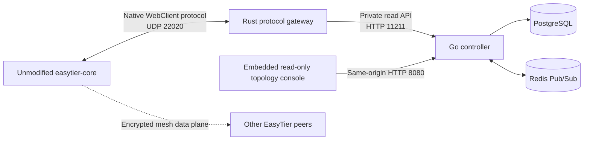

# NexusTier Agent Handoff

This document is the engineering handoff for an AI agent or developer continuing NexusTier. Read it before exploring broadly or changing architecture. It records verified facts, completed work, constraints, pitfalls, and the recommended next implementation slice.

## 1. Repository Snapshot

- Repository: `https://github.com/WuYouOwO/NexusTier`
- Default branch: `main`
- License: GNU AGPLv3 (`AGPL-3.0-only` in Cargo metadata)
- Current implemented components: Rust EasyTier gateway, Go/PostgreSQL telemetry controller, persistent topology API, metric retention, and embedded read-only console
- Gateway package: `nexustier-gateway 0.1.0`
- Current workspace languages: Rust 2024 edition and Go 1.25
- Declared Rust MSRV: `1.95`
- Baseline HEAD for this handoff update: `7126599d59efdbba3a17a131cd6208d8ac6e3d8d`
- Latest implemented telemetry-controller milestone: `302df2f` (Phase 1B)
- Current maturity: internal Alpha; Phase 1B is complete and Phase 1C security/production hardening is in progress
- First complete gateway milestone: `fbc1a9d`
- Latest verified container workflow run: `30686441240` for `7126599` (successful)

Always run `git status --short` and inspect the latest commits before editing. Other agents or the user may commit while work is in progress. Do not rewrite or revert changes you did not create.

## 2. Product Intent

NexusTier is intended to become an open-source zero-trust SDN controller and SD-WAN orchestrator built above EasyTier.

The architectural rule is:

> Centralized control-plane orchestration, decentralized self-converging data plane.

EasyTier remains responsible for:

- NAT traversal and hole punching.
- Encrypted peer-to-peer transport.
- UDP, TCP, WSS, WireGuard, and related data-plane protocols.
- Mesh routing and route convergence.
- Actual packet forwarding between nodes.

NexusTier is intended to provide:

- Device and network inventory.
- IP address management.
- SSO/OIDC admission.
- Declarative ACL and tag policy compilation.
- Topology and traffic telemetry.
- Passwordless SSH and RDP admission in later phases.

Do not route EasyTier data-plane packets through NexusTier. The Rust gateway is a control-protocol boundary, not a VPN relay.

## 3. Target System Architecture



The Rust gateway and Go/PostgreSQL telemetry controller exist today. The controller includes a persistent current-topology API, bounded metric/raw-payload retention, and an embedded responsive console. Both application images are published by GitHub Actions, and the repository includes a PostgreSQL/Gateway/Controller Compose example. This is a deployable internal telemetry Alpha, not a public zero-trust SD-WAN product: Redis, authenticated multi-tenant APIs, device identity, IPAM, and policy distribution have not been created.

## 4. Critical EasyTier Protocol Facts

These facts were verified against EasyTier `v2.6.4`. Do not regress to the earlier incorrect mental model.

1. Port `22020` is the EasyTier configuration-server WebClient channel. Its default transport is UDP. It is not a plain TCP registration socket.
2. `list_peer`, `list_route`, `show_node_info`, and `get_stats` are EasyTier management RPCs.
3. Management RPCs are called in reverse over the same bidirectional WebClient connection. The gateway does not dial a client's local RPC portal through NAT.
4. `easytier-web` is a binary package, not a reusable library crate.
5. Reusable tunnel, RPC, generated Protobuf, and WebClient types are provided by the `easytier` package.
6. The first client connection is normally a feature probe. When secure WebClient transport is supported, the client closes it and reconnects using a Noise handshake and AES-GCM.
7. A feature-probe connection does not send a heartbeat and must never enter the active Session Pool.

The Cargo dependency is deliberately pinned to an exact EasyTier commit:

```toml
easytier = {
  git = "https://github.com/EasyTier/EasyTier.git",
  rev = "8428a89d2dabc94c97d370ec607c6ca142473626",
  default-features = false,
  features = ["aes-gcm", "zstd"]
}
```

The commit corresponds to EasyTier tag `v2.6.4`. Do not switch to the upstream default branch or broaden features without an explicit compatibility and build-size reason.

Keep the `zstd` feature enabled. EasyTier's bidirectional RPC client always advertises Zstd response support; without the feature, official GUI clients compress reverse management RPC responses with Zstd and the Gateway reports `Invalid CompressionAlgoPb` for `list_peer`, `list_route`, `show_node_info`, and `get_stats`.

EasyTier v2.6.4 and its `guarden` dependency declare Rust 1.95 as their minimum supported version. Rust 1.88 fails before compilation with an explicit unsupported-rustc error. Keep Cargo metadata and the Docker builder at 1.95 or newer.

## 5. Implemented Gateway Behavior

The gateway currently provides:

- Native EasyTier UDP listener, default `0.0.0.0:22020`.
- Noise plus AES-GCM secure configuration channel.
- Plaintext feature probes cannot register a heartbeat session.
- Optional shared heartbeat admission token; this is a bootstrap control rather than device identity.
- Machine ID is immutable after the first accepted heartbeat on a connection.
- Heartbeat validation requiring a Machine ID.
- In-memory sessions indexed by EasyTier Machine ID.
- Safe replacement when the same machine reconnects.
- Reverse enumeration of running EasyTier network instances.
- Reverse Node, Peer, Route, and Stats telemetry calls.
- A NexusTier-owned JSON model that hides generated Protobuf details.
- A versioned `nexustier.topology.v1` JSON Schema and cross-language fixture.
- Collection UUIDs, collection boundaries, per-level observation times, and structured error codes.
- Read-only Axum API, default `127.0.0.1:11211`.
- Process and readiness probes.
- Partial telemetry failure reporting.
- Single-flight topology collection with a short snapshot cache.
- Overall collection deadline and bounded machine concurrency.
- Supervised UDP and HTTP services with graceful shutdown.
- A non-root, multi-stage Dockerfile.
- Automated GHCR publication and keyless Cosign signing on pushes to `main` and version tags.
- A required Rust and Go quality job before every container build: fmt, locked Rust tests, strict Clippy, Go tests/vet, PostgreSQL integration tests, and topology contract checks.

## 5.1 Implemented Controller Phase 1B

The Go controller currently provides:

- Typed environment configuration and JSON structured logging.
- A strict `nexustier.topology.v1` HTTP client using the shared fixture.
- PostgreSQL migrations with advisory locking, transactions, and SHA-256 checksums.
- Normalized current-state tables for machines, instances, nodes, and peer links.
- Append-only metric samples by collection and structured collection errors.
- Transactional ingestion idempotent by `collection_id`.
- Detection of a reused collection ID with a different payload.
- Observation-time and collection-time ordering that prevents stale snapshots from overwriting or deleting newer state.
- Partial-failure preservation for missing RPC fields.
- Inactive/disappeared state for entities absent from complete snapshots.
- A sequential polling worker with timeout, jitter, and no overlap.
- Internal `/healthz`, `/readyz`, and `/v1/telemetry/status` endpoints.
- Persistent `/v1/topology` with active/machine filters, stable UUID cursor pagination, collection freshness, and structured errors.
- Embedded same-origin topology console at `/`, with no CDN or separate frontend runtime.
- Configurable batched retention for metric samples and collection raw payloads.
- SHA-256 payload fingerprints preserve collection-ID conflict detection after raw payload pruning.
- Internal `/v1/retention/status` endpoint with recent and process-lifetime cleanup counters.
- Graceful SIGINT/SIGTERM shutdown that waits for the worker before closing PostgreSQL.

The controller console and API now sit behind a single operator session (`internal/auth`): a PBKDF2-HMAC-SHA256 credential, an HMAC-signed `HttpOnly` `SameSite=Strict` cookie, and per-IP login throttling. `/healthz`, `/readyz`, and `/login` stay public. Configuration fails closed: a non-loopback listener without `NEXUSTIER_CONTROLLER_AUTH_PASSWORD_HASH` refuses to start unless `NEXUSTIER_CONTROLLER_AUTH_MODE=disabled` is set explicitly.

This is still single-operator authentication. There is no authorization model, no tenant boundary, and no audit trail, so it remains an internal operational API rather than the future public control-plane API.

Gateway HTTP endpoints:

| Endpoint | Behavior |
| --- | --- |
| `GET /healthz` | Process health; returns `200` even with zero clients |
| `GET /readyz` | Returns `200` with an active session, otherwise `503` |
| `GET /v1/sessions` | Sanitized heartbeat/session snapshots; no user token |
| `GET /v1/topology` | Live reverse RPC collection by machine and instance |

The HTTP API is intentionally unauthenticated and read-only. It must remain bound to loopback or a trusted private service network until the Go control plane provides an authenticated public API.

Controller HTTP endpoints:

| Endpoint | Behavior |
| --- | --- |
| `GET /healthz` | Controller process/HTTP health; does not require PostgreSQL |
| `GET /readyz` | Returns `200` when PostgreSQL responds within one second, otherwise `503` |
| `GET /v1/telemetry/status` | Polling attempt/success times, collection ID/state, last error, and consecutive failures |
| `GET /v1/topology` | Persistent normalized current topology, latest collection/errors, filters, and UUID cursor pagination |
| `GET /v1/retention/status` | Retention configuration, latest cleanup result, counters, and errors |
| `GET /v1/build` | Version, commit, build time, Go version, and platform of the running binary |
| `GET /` | Embedded read-only topology console |
| `GET /login` | Console login form; served without a session |
| `POST /login` | Verifies the operator credential and sets the session cookie |
| `POST /logout` | Clears the session cookie |

Every path except `/healthz`, `/readyz`, and the login routes requires a valid
session cookie when authentication is active. See section 5.1.

## 6. Source Map

```text
.
├── .github/
│   └── workflows/
│       └── docker-publish.yml
├── .env.example
├── Cargo.toml
├── Cargo.lock
├── compose.example.yaml
├── Dockerfile
├── README.md
├── contracts/
│   ├── topology-v1.schema.json
│   └── fixtures/topology-v1.json
├── controller/
│   ├── Dockerfile
│   ├── cmd/nexustier-controller/main.go
│   ├── internal/{api,auth,buildinfo,config,database,gatewayclient,ingest,poller,readmodel,retention,webui}/
│   ├── go.mod
│   └── go.sum
├── crates/
│   └── nexustier-gateway/
│       ├── Cargo.toml
│       ├── README.md
│       └── src/
│           ├── main.rs
│           ├── config.rs
│           ├── gateway.rs
│           ├── session.rs
│           ├── session_pool.rs
│           ├── telemetry.rs
│           └── api.rs
└── docs/
    ├── AGENT_HANDOFF.md
    ├── README.md
    ├── deployment-guide.zh-CN.md
    ├── controller-code.zh-CN.md
    ├── development-plan.zh-CN.md
    ├── gateway-guide.zh-CN.md
    ├── gateway-code.zh-CN.md
    └── usage-guide.zh-CN.md
```

Module ownership:

| File | Responsibility |
| --- | --- |
| `main.rs` | Logging, config parsing, service supervision, shutdown |
| `config.rs` | Typed CLI and environment configuration |
| `gateway.rs` | UDP accept loop, secure negotiation, session lifecycle |
| `session.rs` | Bidirectional RPC manager, heartbeat state, reverse clients |
| `session_pool.rs` | Concurrent Machine ID index and reconnect safety |
| `telemetry.rs` | Reverse calls, DTO conversion, topology semantics |
| `api.rs` | Axum routes, health/readiness, JSON error envelope |

Controller ownership:

| Directory | Responsibility |
| --- | --- |
| `cmd/nexustier-controller` | Process lifecycle, service wiring, signal shutdown |
| `internal/config` | Typed environment configuration |
| `internal/gatewayclient` | topology v1 types, validation, strict HTTP decoding |
| `internal/database` | pgx pool and checksummed migrations |
| `internal/ingest` | Transactional normalized PostgreSQL ingestion |
| `internal/poller` | Sequential polling and status state |
| `internal/readmodel` | Persistent current-topology query model and stable pagination |
| `internal/retention` | Batched metric deletion, raw-payload pruning, and cleanup status |
| `internal/webui` | Embedded React topology console bundle and security headers |
| `internal/api` | Controller health, topology, retention, status, build, and UI routing |
| `internal/auth` | Operator credential, signed session cookie, login throttling, login page |
| `internal/buildinfo` | Build identity injected through `-ldflags`, with a module-stamp fallback |

Read `docs/usage-guide.zh-CN.md` first for the current task-oriented user path and
`docs/deployment-guide.zh-CN.md` for production operations. The detailed source
walkthrough is `docs/gateway-code.zh-CN.md`; the English operational guide is
`crates/nexustier-gateway/README.md`.
Read `controller/README.md` and `docs/controller-code.zh-CN.md` before changing controller persistence or polling semantics.

For current operators and users, start with `docs/current-deployment-guide.zh-CN.md`
and `docs/current-usage-guide.zh-CN.md`. The older deployment and usage guides are
Gateway-only references.

## 7. Important Internal Contracts

### Session identity and reconnect safety

Machine ID is the session key. Remote UDP address is observed metadata only and can change because of NAT rebinding or network switching.

When a new session replaces an old session for the same Machine ID:

1. The new `Arc<GatewaySession>` replaces the old value in `DashMap`.
2. The old RPC manager is stopped.
3. A late disconnect from the old session calls `remove_if_current()`.
4. `Arc::ptr_eq()` prevents the old session from deleting the replacement.

Do not simplify removal to an unconditional `remove(machine_id)`; that reintroduces a real reconnect race.

### Probe connection cleanup

`wait_for_first_heartbeat()` has a 15-second overall deadline and checks RPC-manager liveness every 100 ms. This lets the feature-probe connection disappear quickly after the secure reconnect. Only sessions with a valid heartbeat enter the pool.

### Telemetry isolation

Collection has two levels:

- Machines are collected concurrently with `JoinSet`.
- Instances within a machine are currently collected sequentially to control pressure on a client.
- The four RPCs for one instance are concurrent with `tokio::join!`.
- Every RPC has an independent timeout, default 5 seconds.

Failures are returned in machine- or instance-level `errors` arrays. Do not convert a single instance failure into a global HTTP 500 response.

### Topology semantics

- Direct peer: `route.cost == 1`.
- Direct RTT: default connection RTT, otherwise the minimum available connection RTT.
- Relayed RTT: route path latency.
- RX/TX bytes: sum across the peer's connections.
- Loss rate: default connection first, otherwise the first available connection.
- Tunnel protocols: de-duplicated connection tunnel types.
- Output ordering: machines and instances by UUID; peers by Peer ID.

Stable ordering is intentional for tests, caching, and diffs.

### API DTO boundary

Never expose EasyTier generated Protobuf messages directly from Axum. Convert them in `telemetry.rs` to NexusTier-owned serializable DTOs. This keeps future EasyTier upgrades localized to the Rust adapter.

The heartbeat's `user_token` is deliberately omitted from all API DTOs and logs intended for consumers.

### Controller ingestion safety

- `collection_id` is the retry idempotency key. Same ID plus different JSON is an error.
- Current state is ordered by observation time and collection completion time.
- A stale snapshot may be audited but must not overwrite or delete newer current state.
- Absence means inactive only when the relevant enumeration succeeded.
- Machine/instance disappearance is represented with `active=false`; do not destroy history.
- Partial `list_peers` failures preserve prior direct RTT, loss, traffic, and protocols.
- Never edit an applied migration in place; add a new file. Checksums deliberately fail startup on drift.
- New collections store a SHA-256 of the canonical Go JSON bytes. Retention may prune only payloads with that fingerprint; older rows remain unpruned so duplicate verification can fall back to raw JSON.
- `/v1/topology` reads normalized tables and must not decode `raw_payload` or trigger Gateway RPCs.
- Machine pagination is fixed to ascending UUID order. Keep `active` filtering consistent between machines and instances.

## 8. Configuration and Security Defaults

| CLI option | Environment variable | Default |
| --- | --- | --- |
| `--listen-addr` | `NEXUSTIER_GATEWAY_LISTEN_ADDR` | `0.0.0.0` |
| `--listen-port` | `NEXUSTIER_GATEWAY_LISTEN_PORT` | `22020` |
| `--admission-token` | `NEXUSTIER_GATEWAY_ADMISSION_TOKEN` | unset |
| `--api-addr` | `NEXUSTIER_GATEWAY_API_ADDR` | `127.0.0.1:11211` |
| `--rpc-timeout-ms` | `NEXUSTIER_GATEWAY_RPC_TIMEOUT_MS` | `5000` |
| `--collection-timeout-ms` | `NEXUSTIER_GATEWAY_COLLECTION_TIMEOUT_MS` | `15000` |
| `--machine-concurrency` | `NEXUSTIER_GATEWAY_MACHINE_CONCURRENCY` | `8` |
| `--snapshot-ttl-ms` | `NEXUSTIER_GATEWAY_SNAPSHOT_TTL_MS` | `1000` |

Container behavior differs intentionally: `NEXUSTIER_GATEWAY_API_ADDR=0.0.0.0:11211` inside the container so the API can be reached over a private container network or explicitly published to host loopback.

The container:

- Runs as UID `10001`.
- Requires no TUN device.
- Requires no `NET_ADMIN` capability.
- Exposes `22020/udp` and `11211/tcp`.
- Declares `SIGINT` as its stop signal so Docker uses the gateway's graceful shutdown path.
- Uses `/healthz` as its health check.

## 9. Build and Test Environment

Verified local environment during the gateway milestone:

- Linux VM.
- 16 vCPU.
- Approximately 6 GiB RAM plus 2 GiB swap.
- `protoc 3.21.12`.
- Development toolchain newer than the declared MSRV.

System prerequisite on Debian/Ubuntu:

```bash
apt-get update
apt-get install -y libprotobuf-dev protobuf-compiler
```

`libprotobuf-dev` provides the standard `google/protobuf/*.proto` definitions
required by the `prost-wkt-types` build script.

EasyTier is a large dependency. On a 6 GiB machine, use one Cargo job for release builds:

```bash
CARGO_BUILD_JOBS=1 CARGO_INCREMENTAL=0 \
  cargo build --locked --release --package nexustier-gateway
```

The verified clean release build took approximately 12 minutes 27 seconds and produced a roughly 26.2 MB dynamically linked binary. Runtime dependencies were limited to glibc, libgcc, and libm on the build host.

Do not run another command in the same persistent terminal while a long Cargo build is still active; doing so may interrupt that build. Let long builds own their terminal until completion.

If cross-border dependency access is slow, use standard temporary `HTTP_PROXY`, `HTTPS_PROXY`, or `ALL_PROXY` environment variables. Do not commit a developer's local proxy address into the repository.

## 10. Required Validation Commands

Run these after Rust changes:

```bash
CARGO_BUILD_JOBS=1 cargo test --locked --workspace
CARGO_BUILD_JOBS=1 cargo clippy --locked --workspace --all-targets -- -D warnings
cargo fmt --all -- --check
git diff --check
```

Current expected test count: 15.

Coverage includes:

- Health, readiness, and 404 API contracts.
- Reconnect race protection.
- Direct peer latency, traffic, and loss conversion.
- Relayed path latency and next-hop conversion.
- A real EasyTier v2.6.4 WebClient.
- Secure feature negotiation and reconnect.
- Rejection of plaintext heartbeats, invalid shared admission tokens, and Machine ID changes within a session.
- Exact topology v1 producer serialization against the shared contract fixture.
- Single-flight collection sharing and snapshot TTL expiry.
- A real no-TUN EasyTier network instance.
- Reverse `list_network_instance`, `show_node_info`, `list_peer`, `list_route`, and `get_stats` calls.

The integration test does not require root, TUN, network namespaces, or `NET_ADMIN`.

Run these after controller changes:

```bash
cd controller
go test ./...
go vet ./...
go test -race ./internal/gatewayclient ./internal/poller ./internal/api ./internal/retention ./internal/auth
```

Database ingestion, read-model, or retention changes require a dedicated empty PostgreSQL database:

```bash
NEXUSTIER_TEST_DATABASE_URL='<test database URL>' \
  go test ./internal/ingest ./internal/readmodel ./internal/retention -count=1
```

The integration test truncates telemetry tables. Never point it at production or valuable data. PostgreSQL 18.4 was used for the local verified baseline. Verified cases include migration repeatability, duplicate collections, collection ID payload conflicts, stale snapshot deletion prevention, partial peer failure preservation, and inactive entity convergence.

A real controller process smoke test with a fixture Gateway and isolated PostgreSQL verified migration 002, polling, health/readiness, telemetry status, persistent topology, retention status, embedded UI security headers, normalized writes, and clean SIGTERM exit. Browser validation covered non-empty SVG nodes/edges, click selection, hidden pagination controls, and no horizontal overflow on desktop/mobile viewports.

The release build and real process smoke test were also verified. Smoke-test expectations with no clients:

- `/healthz`: `200`, `active_sessions: 0`.
- `/readyz`: `503`, error code `no_active_sessions`.
- `/v1/sessions`: `[]`.
- `/v1/topology`: an empty `machines` array.
- SIGINT: logs shutdown and returns to the shell.

## 11. Container Publication and Verification Status

The container publication path is operational and has been verified end to end:

- GitHub Actions builds the multi-stage Dockerfile for `linux/amd64`.
- Pushes to `main` publish `main`, `latest`, and `sha-<short-commit>` tags to
  `ghcr.io/wuyouowo/nexustier`.
- Version tags matching `v*.*.*` publish semantic-version tags.
- Published manifests are signed keylessly with Cosign through GitHub OIDC.
- Anonymous GHCR manifest retrieval has been verified.
- Container builds depend on a read-only Rust/Go/PostgreSQL quality job; non-PR publication alone receives package write and OIDC signing permissions.

The first fully successful publication after the build fixes was run
`30452969418` for commit `fd554d8`. Phase 1B was first published by run
`30542389054` for commit `302df2f`. The current publication is run `30686441240`
for commit `7126599`; Rust/Go quality, PostgreSQL integration, both build/push
matrix jobs, Cosign signing, and summary publication all passed. The fixed
images resolve to:

```text
ghcr.io/wuyouowo/nexustier:sha-7126599
sha256:c84e5f7a82cc036d89b237c46b8c4d15b8b1c617f30b866adbe86cf819b47fc2

ghcr.io/wuyouowo/nexustier-controller:sha-7126599
sha256:2733ff26be68abd41760f85c6743f486574971efcb8d4e8adfec15a64dfdb789
```

The Docker build failures and their fixes were:

- Rust 1.88 was below the EasyTier/`guarden` minimum; commit `d2f326b` raised the
  workspace MSRV and builder image to Rust 1.95.
- `prost-wkt-types` could not find `google/protobuf/*.proto`; commit `fd554d8`
  added `libprotobuf-dev` to the builder and documented the prerequisite.

The local development VM still has no Docker CLI. Native debug/release builds,
runtime linkage, HTTP behavior, graceful shutdown, CI image construction,
registry publication, signing, and anonymous manifest access are verified. A
runtime smoke test of the pulled image on a separate Docker-capable host remains
a useful deployment check, not a blocker in the publication pipeline.

## 12. Completed Milestones

Notable history:

| Commit | Milestone |
| --- | --- |
| `975e373` | Initial Rust workspace and gateway scaffold |
| `b580b5e` | Native EasyTier client compatibility test |
| `4c67e14` | Session pool and telemetry foundation |
| `fbc1a9d` | Complete gateway, API, tests, Dockerfile, and docs |
| `6824e59` | Chinese operations and source documentation |
| `cc9c9da` | Initial English agent engineering handoff |
| `f75bb2a` | Current production deployment guide and stop-signal hardening |
| `4865a70` | Initial container publication workflow |
| `5be6ec6` | GHCR publication metadata, signing, and documentation |
| `d2f326b` | Rust MSRV and Docker builder raised to 1.95 |
| `fd554d8` | Standard Protobuf definitions added; first successful GHCR publication |
| `77747e1` | Task-oriented Chinese usage guide and latest verified publication |
| `654c70f` | Secure/bounded Gateway telemetry contract and Go/PostgreSQL controller foundation |
| `44044b0` | Controller image, dual-image GHCR matrix, and Compose stack |
| `302df2f` | Phase 1B persistent topology API, retention, embedded console, tests, and packaging |
| `d8ec0f2` | PostgreSQL repeated-deployment password guidance and `SQLSTATE 28P01` troubleshooting |
| `3c2766c` | Enable required EasyTier Zstd RPC support and add a compression regression test |

Use `git log --oneline --decorate` for the handoff document's own commit and any newer work.

## 13. Recent Field Validation and Operational Lessons

Real deployment with an official EasyTier GUI v2.6.4 client exposed behavior that the in-process compatibility test could not distinguish:

- A client may register successfully while all four reverse instance RPCs fail with `Invalid CompressionAlgoPb`. The cause was disabling EasyTier default features without re-enabling `zstd`; both sides of the in-process test shared the same reduced feature set and silently negotiated no compression. Commit `3c2766c` enables `zstd`, adds a direct compression/decompression regression test, and raises the expected Gateway test count to 15.
- Run `30686441240` built, tested, published, and signed the fixed images. A Docker-capable host should still complete the final field check with the official GUI: the latest collection should move from `partial` with four RPC errors to `complete` with Node/Peer/Stats data.
- For `postgres:18`, the Compose mount `postgres-data:/var/lib/postgresql` is correct. PostgreSQL 18 uses `PGDATA=/var/lib/postgresql/18/docker` and moved its image volume to `/var/lib/postgresql`; do not apply the PostgreSQL 17-and-earlier `/var/lib/postgresql/data` advice.
- `POSTGRES_PASSWORD` only affects first-time `initdb` on an empty data directory. Regenerating `.env` while retaining `postgres-data` leaves the database role on the old password and causes Controller startup failure with `SQLSTATE 28P01`. Preserve the original `.env` or change the role password interactively with `\password`; delete the volume only when all telemetry data may be discarded.
- The EasyTier config-server URL is `udp://host:22020/token`. A literal `$` before the token, or unintended shell expansion in a double-quoted URL, causes heartbeat admission failure. With an empty Session Pool, Gateway `/readyz` is `503` and Controller records a complete collection with `machine_count=0` and `error_count=0`.
- The admission token has appeared in troubleshooting chat and must be treated as compromised. Rotate it and recreate the Gateway container; update every client afterward.
- Do not expose the Controller console or either HTTP API on a public hostname, even temporarily. The operator session is a single shared credential without tenant isolation or audit, and the Gateway API has no authentication at all. Use host loopback plus SSH forwarding. Use an isolated test host, separate subdomain, database, `.env`, and admission token for field testing; do not mix test workloads with a production host.

## 14. Known Limitations

These are intentional MVP limits, not hidden bugs:

- Sessions are memory-only and recover through client reconnect after restart.
- Long-lived client connections cannot migrate between gateway replicas.
- Redis does not synchronize sessions today.
- Gateway topology is collected through a single-flight task and reused for the configured short TTL.
- The Controller console and API require an operator session, but there is no authorization model, tenant isolation, or audit trail. Gateway HTTP endpoints remain unauthenticated.
- Metric/raw-payload retention is implemented, but historical metric queries, charts, downsampling, PostgreSQL partitioning, and long-term aggregation are not.
- The persistent topology API has fixed UUID ordering/cursors and does not support arbitrary sorting, full-text search, or tenant-scoped views.
- The Compose example is single-host only; there is no multi-controller HA design.
- Retention cleanup is idempotent across concurrent controllers but has no leader election or scheduling ownership.
- There is no Redis integration.
- The embedded console is an operational read-only view, not an authenticated public product frontend.
- IPAM, ACL compilation, SSO, SSH, and RDP features are not implemented.
- Only EasyTier v2.6.4 is a tested protocol baseline.

Avoid presenting README roadmap features as implemented software.

## 15. Recommended Next Development Slice

Phase 1B is complete. **Phase 1C: security and production hardening** is in progress. Do not jump directly to IPAM/ACL while the remaining targets are open. Acceptance targets and current state:

1. Add Controller authentication, authorization, tenant boundaries, secure sessions/CSRF handling, rate limits, and audit events. **Partially done.** Single-operator authentication, session cookies, and login throttling ship in `internal/auth`; `SameSite=Strict` plus POST-only mutations cover login CSRF. Authorization, tenant boundaries, and audit events are still open.
2. Replace the shared bootstrap token as the long-term trust model with device enrollment, revocable credentials, and Machine ID binding.
3. Establish an isolated field-test environment and a compatibility matrix for official GUI and CLI clients across supported operating systems.
4. Automate repeated Compose deployment, credential rotation, backup/restore, upgrade/rollback, reconnect, and long-running stability checks.
5. Add build/protocol version reporting so an operator can prove which Gateway and Controller images are running. **Partially done.** The Controller serves `GET /v1/build` (version, commit, build time, Go version, platform) from `internal/buildinfo`, stamped through Docker build args in the publish workflow, and the console header shows the short commit. The Gateway has no equivalent endpoint yet.
6. Define a historical metric query contract, retention tiers, downsampling, and PostgreSQL partitioning as the following Phase 1D before exposing charts.
7. Decide whether Redis/WebSocket publication is needed only after durable reads, access control, and multi-controller ownership are stable.

Completion of Phase 1C is the threshold for a controlled Beta. Until then, keep the system classified as an internal Alpha and do not expose the API/console to the internet: the operator session is a single shared credential with no tenant isolation or audit trail, and the Gateway API remains unauthenticated.

The open targets are 2 (device enrollment), 3 (field-test matrix), 4 (deployment automation), and the remainders of 1 and 5. Target 4 is the natural next slice: it needs no new protocol surface and makes every later change verifiable.

## 16. Rules for Future Changes

- Keep control-plane and data-plane responsibilities separate.
- Pin protocol dependencies; do not silently track upstream branches.
- Preserve the localhost/private-network API default.
- Never expose heartbeat user tokens in API responses.
- Preserve partial-success telemetry semantics.
- Preserve reconnect race protection.
- Keep Gateway live topology and Controller persistent topology as separate contracts; do not make one a transparent proxy for the other.
- Preserve UUID cursor ordering and apply active filtering consistently to machines and instances.
- Do not prune a collection raw payload unless its SHA-256 fingerprint is present; older rows rely on raw JSON duplicate verification.
- Prefer existing EasyTier RPC types over reimplementing wire protocol details.
- Keep production code free of placeholder `TODO` implementations.
- Add focused tests for each behavior change.
- Run the required validation commands before committing.
- Do not commit local proxy settings, credentials, generated `target/` output, or editor state.
- Do not amend or rewrite user/agent commits unless explicitly requested.

## 17. Fast Start Checklist

For a new agent:

1. Read this document.
2. Read `README.md`, `docs/usage-guide.zh-CN.md`, and
  `crates/nexustier-gateway/README.md`.
3. Read `docs/deployment-guide.zh-CN.md` before changing packaging, ports,
  shutdown, or security defaults.
4. Read the source files in the order listed in Section 6.
5. Run `git status --short` and inspect recent history.
6. Confirm Rust 1.95 or newer, `protoc`, and the standard Protobuf definitions.
7. Run the locked test and Clippy commands.
8. Check the latest `Build and publish container image` run after changes to
  `main`; a successful push also updates and signs GHCR tags.
9. Choose one small Phase 1C module; start with authentication/device identity or field-test automation, not Redis/IPAM/ACL in parallel.
10. Update this handoff when architecture, verified commands, publication state,
   or milestone status changes.
