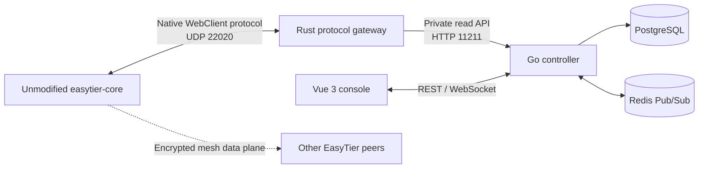

# NexusTier Agent Handoff

This document is the engineering handoff for an AI agent or developer continuing NexusTier. Read it before exploring broadly or changing architecture. It records verified facts, completed work, constraints, pitfalls, and the recommended next implementation slice.

## 1. Repository Snapshot

- Repository: `https://github.com/WuYouOwO/NexusTier`
- Default branch: `main`
- License: GNU AGPLv3 (`AGPL-3.0-only` in Cargo metadata)
- Current implemented product component: Rust native EasyTier gateway
- Gateway package: `nexustier-gateway 0.1.0`
- Current workspace language: Rust 2024 edition
- Declared Rust MSRV: `1.88`
- Latest completed documentation milestone before this handoff: `6824e59`
- First complete gateway milestone: `fbc1a9d`

Always run `git status --short` and inspect the latest commits before editing. Other agents or the user may commit while work is in progress. Do not rewrite or revert changes you did not create.

## 2. Product Intent

NexusTier is intended to become an open-source zero-trust SDN controller and SD-WAN orchestrator built above EasyTier.

The architectural rule is:

> Centralized control-plane orchestration, decentralized self-converging data plane.

EasyTier remains responsible for:

- NAT traversal and hole punching.
- Encrypted peer-to-peer transport.
- UDP, TCP, WSS, WireGuard, and related data-plane protocols.
- Mesh routing and route convergence.
- Actual packet forwarding between nodes.

NexusTier is intended to provide:

- Device and network inventory.
- IP address management.
- SSO/OIDC admission.
- Declarative ACL and tag policy compilation.
- Topology and traffic telemetry.
- Passwordless SSH and RDP admission in later phases.

Do not route EasyTier data-plane packets through NexusTier. The Rust gateway is a control-protocol boundary, not a VPN relay.

## 3. Target System Architecture



Only the Rust gateway exists today. The Go controller, PostgreSQL schema, Redis integration, and Vue application have not been created.

## 4. Critical EasyTier Protocol Facts

These facts were verified against EasyTier `v2.6.4`. Do not regress to the earlier incorrect mental model.

1. Port `22020` is the EasyTier configuration-server WebClient channel. Its default transport is UDP. It is not a plain TCP registration socket.
2. `list_peer`, `list_route`, `show_node_info`, and `get_stats` are EasyTier management RPCs.
3. Management RPCs are called in reverse over the same bidirectional WebClient connection. The gateway does not dial a client's local RPC portal through NAT.
4. `easytier-web` is a binary package, not a reusable library crate.
5. Reusable tunnel, RPC, generated Protobuf, and WebClient types are provided by the `easytier` package.
6. The first client connection is normally a feature probe. When secure WebClient transport is supported, the client closes it and reconnects using a Noise handshake and AES-GCM.
7. A feature-probe connection does not send a heartbeat and must never enter the active Session Pool.

The Cargo dependency is deliberately pinned to an exact EasyTier commit:

```toml
easytier = {
  git = "https://github.com/EasyTier/EasyTier.git",
  rev = "8428a89d2dabc94c97d370ec607c6ca142473626",
  default-features = false,
  features = ["aes-gcm"]
}
```

The commit corresponds to EasyTier tag `v2.6.4`. Do not switch to the upstream default branch or broaden features without an explicit compatibility and build-size reason.

## 5. Implemented Gateway Behavior

The gateway currently provides:

- Native EasyTier UDP listener, default `0.0.0.0:22020`.
- Noise plus AES-GCM secure configuration channel.
- Heartbeat validation requiring a Machine ID.
- In-memory sessions indexed by EasyTier Machine ID.
- Safe replacement when the same machine reconnects.
- Reverse enumeration of running EasyTier network instances.
- Reverse Node, Peer, Route, and Stats telemetry calls.
- A NexusTier-owned JSON model that hides generated Protobuf details.
- Read-only Axum API, default `127.0.0.1:11211`.
- Process and readiness probes.
- Partial telemetry failure reporting.
- Supervised UDP and HTTP services with graceful shutdown.
- A non-root, multi-stage Dockerfile.

HTTP endpoints:

| Endpoint | Behavior |
| --- | --- |
| `GET /healthz` | Process health; returns `200` even with zero clients |
| `GET /readyz` | Returns `200` with an active session, otherwise `503` |
| `GET /v1/sessions` | Sanitized heartbeat/session snapshots; no user token |
| `GET /v1/topology` | Live reverse RPC collection by machine and instance |

The HTTP API is intentionally unauthenticated and read-only. It must remain bound to loopback or a trusted private service network until the Go control plane provides an authenticated public API.

## 6. Source Map

```text
.
├── Cargo.toml
├── Cargo.lock
├── Dockerfile
├── README.md
├── crates/
│   └── nexustier-gateway/
│       ├── Cargo.toml
│       ├── README.md
│       └── src/
│           ├── main.rs
│           ├── config.rs
│           ├── gateway.rs
│           ├── session.rs
│           ├── session_pool.rs
│           ├── telemetry.rs
│           └── api.rs
└── docs/
    ├── README.md
    ├── gateway-guide.zh-CN.md
    ├── gateway-code.zh-CN.md
    └── AGENT_HANDOFF.md
```

Module ownership:

| File | Responsibility |
| --- | --- |
| `main.rs` | Logging, config parsing, service supervision, shutdown |
| `config.rs` | Typed CLI and environment configuration |
| `gateway.rs` | UDP accept loop, secure negotiation, session lifecycle |
| `session.rs` | Bidirectional RPC manager, heartbeat state, reverse clients |
| `session_pool.rs` | Concurrent Machine ID index and reconnect safety |
| `telemetry.rs` | Reverse calls, DTO conversion, topology semantics |
| `api.rs` | Axum routes, health/readiness, JSON error envelope |

Read the Chinese source walkthrough at `docs/gateway-code.zh-CN.md` for a detailed function-level explanation. The English operational guide is `crates/nexustier-gateway/README.md`.

## 7. Important Internal Contracts

### Session identity and reconnect safety

Machine ID is the session key. Remote UDP address is observed metadata only and can change because of NAT rebinding or network switching.

When a new session replaces an old session for the same Machine ID:

1. The new `Arc<GatewaySession>` replaces the old value in `DashMap`.
2. The old RPC manager is stopped.
3. A late disconnect from the old session calls `remove_if_current()`.
4. `Arc::ptr_eq()` prevents the old session from deleting the replacement.

Do not simplify removal to an unconditional `remove(machine_id)`; that reintroduces a real reconnect race.

### Probe connection cleanup

`wait_for_first_heartbeat()` has a 15-second overall deadline and checks RPC-manager liveness every 100 ms. This lets the feature-probe connection disappear quickly after the secure reconnect. Only sessions with a valid heartbeat enter the pool.

### Telemetry isolation

Collection has two levels:

- Machines are collected concurrently with `JoinSet`.
- Instances within a machine are currently collected sequentially to control pressure on a client.
- The four RPCs for one instance are concurrent with `tokio::join!`.
- Every RPC has an independent timeout, default 5 seconds.

Failures are returned in machine- or instance-level `errors` arrays. Do not convert a single instance failure into a global HTTP 500 response.

### Topology semantics

- Direct peer: `route.cost == 1`.
- Direct RTT: default connection RTT, otherwise the minimum available connection RTT.
- Relayed RTT: route path latency.
- RX/TX bytes: sum across the peer's connections.
- Loss rate: default connection first, otherwise the first available connection.
- Tunnel protocols: de-duplicated connection tunnel types.
- Output ordering: machines and instances by UUID; peers by Peer ID.

Stable ordering is intentional for tests, caching, and diffs.

### API DTO boundary

Never expose EasyTier generated Protobuf messages directly from Axum. Convert them in `telemetry.rs` to NexusTier-owned serializable DTOs. This keeps future EasyTier upgrades localized to the Rust adapter.

The heartbeat's `user_token` is deliberately omitted from all API DTOs and logs intended for consumers.

## 8. Configuration and Security Defaults

| CLI option | Environment variable | Default |
| --- | --- | --- |
| `--listen-addr` | `NEXUSTIER_GATEWAY_LISTEN_ADDR` | `0.0.0.0` |
| `--listen-port` | `NEXUSTIER_GATEWAY_LISTEN_PORT` | `22020` |
| `--api-addr` | `NEXUSTIER_GATEWAY_API_ADDR` | `127.0.0.1:11211` |
| `--rpc-timeout-ms` | `NEXUSTIER_GATEWAY_RPC_TIMEOUT_MS` | `5000` |

Container behavior differs intentionally: `NEXUSTIER_GATEWAY_API_ADDR=0.0.0.0:11211` inside the container so the API can be reached over a private container network or explicitly published to host loopback.

The container:

- Runs as UID `10001`.
- Requires no TUN device.
- Requires no `NET_ADMIN` capability.
- Exposes `22020/udp` and `11211/tcp`.
- Uses `/healthz` as its health check.

## 9. Build and Test Environment

Verified local environment during the gateway milestone:

- Linux VM.
- 16 vCPU.
- Approximately 6 GiB RAM plus 2 GiB swap.
- `protoc 3.21.12`.
- Development toolchain newer than the declared MSRV.

System prerequisite on Debian/Ubuntu:

```bash
apt-get update
apt-get install -y protobuf-compiler
```

EasyTier is a large dependency. On a 6 GiB machine, use one Cargo job for release builds:

```bash
CARGO_BUILD_JOBS=1 CARGO_INCREMENTAL=0 \
  cargo build --locked --release --package nexustier-gateway
```

The verified clean release build took approximately 12 minutes 27 seconds and produced a roughly 26.2 MB dynamically linked binary. Runtime dependencies were limited to glibc, libgcc, and libm on the build host.

Do not run another command in the same persistent terminal while a long Cargo build is still active; doing so may interrupt that build. Let long builds own their terminal until completion.

If cross-border dependency access is slow, use standard temporary `HTTP_PROXY`, `HTTPS_PROXY`, or `ALL_PROXY` environment variables. Do not commit a developer's local proxy address into the repository.

## 10. Required Validation Commands

Run these after Rust changes:

```bash
CARGO_BUILD_JOBS=1 cargo test --locked --workspace
CARGO_BUILD_JOBS=1 cargo clippy --locked --workspace --all-targets -- -D warnings
cargo fmt --all -- --check
git diff --check
```

Current expected test count: 8.

Coverage includes:

- Health, readiness, and 404 API contracts.
- Reconnect race protection.
- Direct peer latency, traffic, and loss conversion.
- Relayed path latency and next-hop conversion.
- A real EasyTier v2.6.4 WebClient.
- Secure feature negotiation and reconnect.
- A real no-TUN EasyTier network instance.
- Reverse `list_network_instance`, `show_node_info`, `list_peer`, `list_route`, and `get_stats` calls.

The integration test does not require root, TUN, network namespaces, or `NET_ADMIN`.

The release build and real process smoke test were also verified. Smoke-test expectations with no clients:

- `/healthz`: `200`, `active_sessions: 0`.
- `/readyz`: `503`, error code `no_active_sessions`.
- `/v1/sessions`: `[]`.
- `/v1/topology`: an empty `machines` array.
- SIGINT: logs shutdown and returns to the shell.

## 11. Container Verification Status

The Dockerfile is implemented and statically reviewed, but the development VM did not have a Docker CLI installed during the milestone. Therefore:

- Native debug and release builds were verified.
- Runtime linkage was verified.
- HTTP and graceful-shutdown smoke tests were verified natively.
- `docker build` itself has not yet been executed in this environment.

The next agent with a container runtime should run:

```bash
docker build -t nexustier-gateway:dev .
docker run --rm \
  -p 22020:22020/udp \
  -p 127.0.0.1:11211:11211/tcp \
  nexustier-gateway:dev
```

Then verify `http://127.0.0.1:11211/healthz` and image health status.

## 12. Completed Milestones

Notable history:

| Commit | Milestone |
| --- | --- |
| `975e373` | Initial Rust workspace and gateway scaffold |
| `b580b5e` | Native EasyTier client compatibility test |
| `4c67e14` | Session pool and telemetry foundation |
| `fbc1a9d` | Complete gateway, API, tests, Dockerfile, and docs |
| `6824e59` | Chinese operations and source documentation |

Use `git log --oneline --decorate` for the handoff document's own commit and any newer work.

## 13. Known Limitations

These are intentional MVP limits, not hidden bugs:

- Sessions are memory-only and recover through client reconnect after restart.
- Long-lived client connections cannot migrate between gateway replicas.
- Redis does not synchronize sessions today.
- Topology is collected live on each `/v1/topology` request.
- There is no historical telemetry storage.
- The HTTP API has no authentication.
- There is no rate limit or topology snapshot cache yet.
- There is no Go controller.
- There is no PostgreSQL schema or migration framework.
- There is no Redis integration.
- There is no Vue frontend.
- IPAM, ACL compilation, SSO, SSH, and RDP features are not implemented.
- Only EasyTier v2.6.4 is a tested protocol baseline.

Avoid presenting README roadmap features as implemented software.

## 14. Recommended Next Development Slice

The next module should be the Go control-plane telemetry ingestion foundation. Keep the same small-step rule: finish and verify one module before starting the frontend.

Recommended order:

1. Create a Go controller module with typed configuration and structured logging.
2. Design PostgreSQL migrations for machines, network instances, nodes, peer links, metric samples, and collection runs.
3. Define a typed Go client for the Rust `/v1/topology` contract.
4. Implement an idempotent topology upsert transaction.
5. Add a bounded polling worker with timeout, jitter, and overlap prevention.
6. Add retention policy support for high-volume metrics.
7. Expose a minimal controller health/read API.
8. Add Redis publication only after durable PostgreSQL ingestion is correct.

Suggested first concrete deliverable:

> PostgreSQL schema and migrations plus Go model tests for devices, EasyTier instances, nodes, peer links, metric samples, and telemetry collection status.

Design requirements for that slice:

- Preserve the Rust API's machine/instance hierarchy.
- Treat Machine ID and Instance ID as UUIDs.
- Treat EasyTier Peer ID as network-instance scoped, not globally unique.
- Model links with observed source instance, destination Peer ID, next hop, direct/relayed state, RTT, loss, traffic counters, and observation time.
- Do not store every topology response as an opaque JSON blob instead of normalized state. A raw payload audit column may be supplementary, not the primary model.
- Keep metric retention separate from current topology state.
- Make ingestion idempotent for repeated snapshots.
- Record partial collection errors without discarding successful machine or instance data.

## 15. Rules for Future Changes

- Keep control-plane and data-plane responsibilities separate.
- Pin protocol dependencies; do not silently track upstream branches.
- Preserve the localhost/private-network API default.
- Never expose heartbeat user tokens in API responses.
- Preserve partial-success telemetry semantics.
- Preserve reconnect race protection.
- Prefer existing EasyTier RPC types over reimplementing wire protocol details.
- Keep production code free of placeholder `TODO` implementations.
- Add focused tests for each behavior change.
- Run the required validation commands before committing.
- Do not commit local proxy settings, credentials, generated `target/` output, or editor state.
- Do not amend or rewrite user/agent commits unless explicitly requested.

## 16. Fast Start Checklist

For a new agent:

1. Read this document.
2. Read `README.md` and `crates/nexustier-gateway/README.md`.
3. Read the source files in the order listed in Section 6.
4. Run `git status --short` and inspect recent history.
5. Confirm `protoc --version`.
6. Run the locked test and Clippy commands.
7. Choose one small next module; do not start Go, database, Redis, and frontend work simultaneously.
8. Update this handoff when architecture, verified commands, or milestone status changes.
