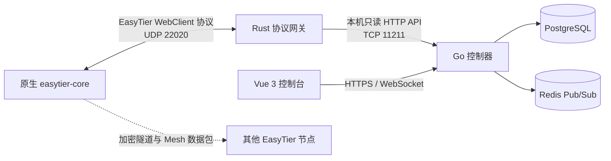

# NexusTier 中文文档

本目录保存 NexusTier 的中文设计、部署和源码说明。当前已交付模块是 Rust 原生 EasyTier 接入网关，后续 Go 控制器、PostgreSQL、Redis 和前端控制台文档将在对应模块落地后补充。

## 文档导航

- [AI Agent Engineering Handoff (English)](AGENT_HANDOFF.md)
- [NexusTier Gateway 0.1.0 生产部署指南](deployment-guide.zh-CN.md)
- [Rust 网关使用与部署手册](gateway-guide.zh-CN.md)
- [Rust 网关源码架构解析](gateway-code.zh-CN.md)
- [项目总览](../README.md)
- [Rust 网关英文说明](../crates/nexustier-gateway/README.md)

## 当前系统边界

Rust 网关只负责控制通道兼容、在线会话管理和反向遥测 RPC。EasyTier 节点之间的数据包不经过 NexusTier，继续由 EasyTier 数据面完成 NAT 穿透、加密传输和 Mesh 路由收敛。

## 版本基线

| 组件 | 当前基线 |
| --- | --- |
| NexusTier Gateway | `0.1.0` |
| EasyTier | `v2.6.4` |
| EasyTier commit | `8428a89d2dabc94c97d370ec607c6ca142473626` |
| Rust MSRV | `1.88` |
| 许可证 | AGPLv3 |
