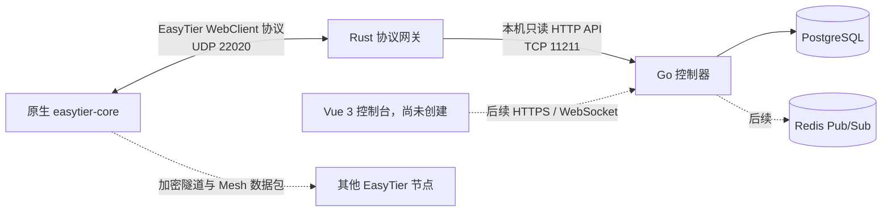

# NexusTier 中文文档

本目录保存 NexusTier 的中文设计、部署和源码说明。已发布模块是 Rust 原生 EasyTier 接入网关；当前源码还包含 Go 控制器 PostgreSQL 遥测摄取基础 WIP。Redis 和前端控制台尚未创建。

## 文档导航

- [AI Agent Engineering Handoff (English)](AGENT_HANDOFF.md)
- [当前版本端到端部署指南](current-deployment-guide.zh-CN.md)
- [当前版本用户教程](current-usage-guide.zh-CN.md)
- [遥测摄取基础开发计划（已完成）](development-plan.zh-CN.md)
- [内部 API 契约](../contracts/README.md)
- [Gateway 专项使用指南](usage-guide.zh-CN.md)
- [Gateway 专项生产部署指南](deployment-guide.zh-CN.md)
- [Rust 网关使用与部署手册](gateway-guide.zh-CN.md)
- [Rust 网关源码架构解析](gateway-code.zh-CN.md)
- [Go 控制器 WIP 运行说明](../controller/README.md)
- [Go 控制器源码架构解析](controller-code.zh-CN.md)
- [项目总览](../README.md)
- [Rust 网关英文说明](../crates/nexustier-gateway/README.md)

## 当前系统边界

Rust 网关只负责控制通道兼容、在线会话管理和反向遥测 RPC。Go 控制器当前负责 topology v1 轮询与 PostgreSQL 持久化。EasyTier 节点之间的数据包不经过 NexusTier，继续由 EasyTier 数据面完成 NAT 穿透、加密传输和 Mesh 路由收敛。

## 版本基线

| 组件 | 当前基线 |
| --- | --- |
| NexusTier Gateway | `0.1.0` |
| 当前源码提交 | `654c70fbb70289c5313f7685abff72a59b3c9f7b` |
| 当前 Gateway 镜像 | `ghcr.io/wuyouowo/nexustier:sha-654c70f` |
| EasyTier | `v2.6.4` |
| EasyTier commit | `8428a89d2dabc94c97d370ec607c6ca142473626` |
| Rust MSRV | `1.95` |
| Go Controller | WIP，Go `1.25` |
| PostgreSQL 验证基线 | `18.4` |
| 许可证 | AGPLv3 |
