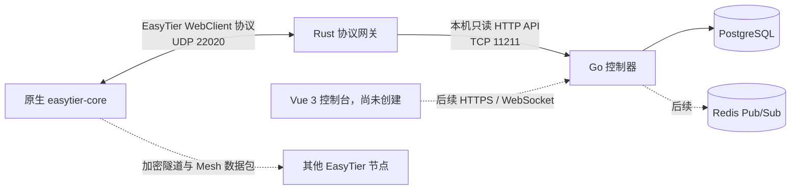

# NexusTier 中文文档

本目录保存 NexusTier 当前遥测底座的部署、使用、契约和源码说明。Rust Gateway 与
Go Controller 均已发布容器镜像，并可通过仓库 Compose 示例与 PostgreSQL 组成完整
遥测链路。Redis、前端控制台、身份系统和策略下发尚未实现。

## 文档导航

- [AI Agent Engineering Handoff (English)](AGENT_HANDOFF.md)
- [当前版本端到端部署指南](current-deployment-guide.zh-CN.md)
- [当前版本用户教程](current-usage-guide.zh-CN.md)
- [遥测摄取基础开发计划（已完成）](development-plan.zh-CN.md)
- [内部 API 契约](../contracts/README.md)
- [Gateway 专项使用指南](usage-guide.zh-CN.md)
- [Gateway 专项生产部署指南](deployment-guide.zh-CN.md)
- [Rust 网关使用与部署手册](gateway-guide.zh-CN.md)
- [Rust 网关源码架构解析](gateway-code.zh-CN.md)
- [Go 控制器运行与边界说明](../controller/README.md)
- [Go 控制器源码架构解析](controller-code.zh-CN.md)
- [项目总览](../README.md)
- [Rust 网关英文说明](../crates/nexustier-gateway/README.md)

## 当前系统边界

Rust Gateway 只负责控制通道兼容、在线会话管理和反向遥测 RPC。Go Controller 只负责
topology v1 轮询、校验与 PostgreSQL 持久化，并提供内部健康和摄取状态 API。EasyTier
节点之间的数据包不经过 NexusTier，继续由 EasyTier 数据面完成 NAT 穿透、加密传输和
Mesh 路由收敛。

当前不提供 Web UI、公开用户 API、OIDC/RBAC、IPAM、ACL、网络配置下发、Redis、
多副本 HA 或历史指标保留策略。路线图文档中的目标不能当作已经实现的能力。

## 版本基线

| 组件 | 当前基线 |
| --- | --- |
| 已验证应用提交 | `44044b026f759331bb354b7af3b4390227085a58` |
| Gateway 镜像 | `ghcr.io/wuyouowo/nexustier:sha-44044b0` |
| Controller 镜像 | `ghcr.io/wuyouowo/nexustier-controller:sha-44044b0` |
| 双镜像发布工作流 | GitHub Actions Run `30527587634` |
| EasyTier | `v2.6.4` |
| EasyTier commit | `8428a89d2dabc94c97d370ec607c6ca142473626` |
| Rust MSRV | `1.95` |
| Go Controller | 遥测摄取基础，Go `1.25` |
| PostgreSQL 验证基线 | `18.4` |
| 容器平台 | `linux/amd64` |
| 许可证 | AGPLv3 |
