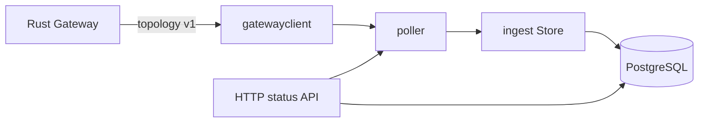

# Go 控制器源码架构解析（WIP）

## 1. 模块边界

当前 Go 控制器只完成遥测摄取底座：从 Rust Gateway 拉取版本化拓扑，写入
PostgreSQL，并暴露最小运行状态 API。它不参与 EasyTier 数据包转发，也尚未
承担用户登录、策略编译或前端公开 API。



## 2. 源码目录

```text
controller/
├── cmd/nexustier-controller/main.go
├── internal/
│   ├── api/             健康、就绪和摄取状态 API
│   ├── config/          类型化环境配置
│   ├── database/        pgx pool、迁移与 migration checksum
│   ├── gatewayclient/   topology v1 类型、校验和 HTTP client
│   ├── ingest/          PostgreSQL 幂等摄取事务
│   └── poller/          串行轮询、抖动、超时和运行状态
├── go.mod
└── go.sum
```

## 3. 跨语言契约

`gatewayclient` 严格解码仓库 `contracts/topology-v1.schema.json` 定义的
`nexustier.topology.v1`：

- HTTP body 限制为 16 MiB。
- JSON decoder 拒绝未知字段和尾随 JSON 值。
- UUID、采集时间顺序、分层观测时间和 PostgreSQL 时间范围在写入前验证。
- Rust 生产者与 Go 消费者共同使用 `contracts/fixtures/topology-v1.json`。

这让 Rust DTO 字段变化在测试阶段失败，而不是在生产摄取时静默丢字段。

## 4. 轮询模型

`poller.Worker.Run()` 同步完成一轮 fetch + transaction，之后才启动下一次
timer，因此同一 worker 天然不会重叠。每轮使用独立 context timeout，基础
间隔附加正负随机抖动。

worker 使用 `RWMutex` 保存：

- 最近尝试和成功时间。
- 最近 collection ID。
- `ingested` 或 `duplicate` 状态。
- 最近错误和连续失败次数。

主进程在信号或 HTTP 服务异常后先取消 worker，等待其退出，再通过 defer 关闭
数据库 pool，避免关闭期间继续写入。

## 5. 幂等摄取事务

一次 `Store.Ingest()` 是一个 PostgreSQL 事务：

1. 验证 topology v1。
2. 插入 `telemetry_collection_runs`。
3. `collection_id` 已存在时比较 raw JSON；完全相同返回 duplicate，不同则报错。
4. Upsert Machine、Instance、Node 和当前 Peer 链路。
5. 按 collection 追加 Metric samples。
6. 保存 snapshot/machine/instance 层错误。
7. 完整枚举时标记消失实体 inactive。
8. 一次性提交；任一步失败则整体回滚。

## 6. 乱序与局部失败

当前状态更新同时比较 `observed_at` 和 `collection completed_at`。较旧快照可以
进入 collection audit 与历史指标，但不能覆盖或删除更晚的当前状态。

局部失败按 operation 判断：

- `list_network_instances` 失败：不把缺失实例标记为 inactive。
- `list_routes` 失败：不删除当前 Peer。
- `list_peers` 失败：直连 Peer 保留已有 RTT、丢包、流量和 Tunnel 协议；中继 RTT
  仍可使用成功返回的 Route path latency。
- `show_node_info` 失败：不删除上次 Node 信息。
- 顶层 collection error：不把本轮未返回的 Machine 标记为 inactive。

完整成功快照中的消失 Machine 和 Instance 使用 `active=false` 与
`disappeared_at` 表达，不物理删除历史实体。

## 7. 迁移安全

迁移文件嵌入控制器二进制，并在单个事务中按文件名顺序执行：

- PostgreSQL advisory transaction lock 防止多个实例并发迁移。
- `schema_migrations` 保存文件名与 SHA-256 checksum。
- 已应用文件内容被修改时启动失败，要求新增 migration，而不是改写历史。

## 8. API 与安全边界

- `/healthz` 只表示进程存活。
- `/readyz` 要求数据库可连接，不代表最近遥测一定成功。
- `/v1/telemetry/status` 提供 worker 新鲜度和失败状态。

API 当前无认证并默认绑定 `127.0.0.1:8080`。后续公开 REST/WebSocket API 必须
先设计认证、授权、租户边界和速率限制，不能直接扩展当前内部状态 API 对公网。

## 9. 验证覆盖

当前测试覆盖：

- Rust fixture 的 Go 严格解码和未知字段拒绝。
- 配置默认值与抖动约束。
- worker 无重叠、取消和失败状态。
- 健康/就绪 API。
- PostgreSQL migration 幂等。
- collection 重试幂等和 UUID payload 冲突。
- 乱序快照不能删除较新 Peer。
- `list_peers` 局部失败保留直连 RTT。
- 完整快照把消失 Machine/Instance 标记 inactive。
- 真实进程迁移、首次轮询、API、数据库写入与 SIGTERM 烟测。

## 10. 下一步

下一切片应先实现指标保留/分区策略和当前拓扑只读查询 API，再考虑 Redis 与前端。
不要在 durable model 和查询契约稳定前同时启动 Redis、WebSocket 和可视化开发。
