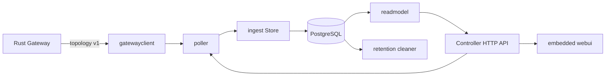

# Go Controller 源码架构解析

当前运行和部署流程见[当前版本端到端部署指南](current-deployment-guide.zh-CN.md)，
面向用户的控制台、API 和 SQL 操作见[当前版本用户教程](current-usage-guide.zh-CN.md)。

## 1. 模块边界

Go Controller 从 Rust Gateway 拉取版本化拓扑，写入 PostgreSQL，从规范化表构建
持久化当前拓扑读模型，执行指标保留，并内嵌只读 Web 控制台。它不参与 EasyTier
数据包转发，也不承担用户登录、租户授权、网络创建或策略编译。



## 2. 源码目录

```text
controller/
├── cmd/nexustier-controller/main.go
├── internal/
│   ├── api/             健康、状态、保留和持久化拓扑 API
│   ├── config/          类型化环境配置
│   ├── database/        pgx pool、迁移与 migration checksum
│   ├── gatewayclient/   topology v1 类型、校验和 HTTP client
│   ├── ingest/          PostgreSQL 幂等摄取事务
│   ├── poller/          串行轮询、抖动、超时和运行状态
│   ├── readmodel/       当前拓扑稳定分页和嵌套查询
│   ├── retention/       指标删除、raw payload 裁剪和运行状态
│   └── webui/           内嵌 HTML/CSS/JS 拓扑控制台
├── go.mod
└── go.sum
```

## 3. 跨语言契约

`gatewayclient` 严格解码仓库 `contracts/topology-v1.schema.json` 定义的
`nexustier.topology.v1`：

- HTTP body 限制为 16 MiB。
- JSON decoder 拒绝未知字段和尾随 JSON 值。
- UUID、采集时间顺序、分层观测时间和 PostgreSQL 时间范围在写入前验证。
- Rust 生产者与 Go 消费者共同使用 `contracts/fixtures/topology-v1.json`。

这让 Rust DTO 字段变化在测试阶段失败，而不是在生产摄取时静默丢字段。

## 4. 轮询模型

`poller.Worker.Run()` 同步完成一轮 fetch + transaction，之后才启动下一次
timer，因此同一 worker 天然不会重叠。每轮使用独立 context timeout，基础
间隔附加正负随机抖动。

worker 使用 `RWMutex` 保存：

- 最近尝试和成功时间。
- 最近 collection ID。
- `ingested` 或 `duplicate` 状态。
- 最近错误和连续失败次数。

主进程在信号或 HTTP 服务异常后先取消 worker，等待其退出，再通过 defer 关闭
数据库 pool，避免关闭期间继续写入。

## 5. 幂等摄取事务

一次 `Store.Ingest()` 是一个 PostgreSQL 事务：

1. 验证 topology v1。
2. 插入 `telemetry_collection_runs`。
3. 计算规范化 JSON 的 SHA-256；`collection_id` 已存在时比较指纹，相同返回
  duplicate，不同则报错。旧 migration 行没有指纹时回退比较 raw JSON。
4. Upsert Machine、Instance、Node 和当前 Peer 链路。
5. 按 collection 追加 Metric samples。
6. 保存 snapshot/machine/instance 层错误。
7. 完整枚举时标记消失实体 inactive。
8. 一次性提交；任一步失败则整体回滚。

`002_metric_retention.sql` 为新 collection 增加 `raw_payload_sha256` 和
`payload_pruned_at`。保留期后 raw payload 可以裁剪，但 SHA-256 指纹继续保护
collection ID 冲突语义。

## 6. 乱序与局部失败

当前状态更新同时比较 `observed_at` 和 `collection completed_at`。较旧快照可以
进入 collection audit 与历史指标，但不能覆盖或删除更晚的当前状态。

局部失败按 operation 判断：

- `list_network_instances` 失败：不把缺失实例标记为 inactive。
- `list_routes` 失败：不删除当前 Peer。
- `list_peers` 失败：直连 Peer 保留已有 RTT、丢包、流量和 Tunnel 协议；中继 RTT
  仍可使用成功返回的 Route path latency。
- `show_node_info` 失败：不删除上次 Node 信息。
- 顶层 collection error：不把本轮未返回的 Machine 标记为 inactive。

完整成功快照中的消失 Machine 和 Instance 使用 `active=false` 与
`disappeared_at` 表达，不物理删除历史实体。

## 7. 迁移安全

迁移文件嵌入控制器二进制，并在单个事务中按文件名顺序执行：

- PostgreSQL advisory transaction lock 防止多个实例并发迁移。
- `schema_migrations` 保存文件名与 SHA-256 checksum。
- 已应用文件内容被修改时启动失败，要求新增 migration，而不是改写历史。

## 8. 当前拓扑读模型

`readmodel.Store.CurrentTopology()` 只读取规范化表，不解码 `raw_payload`，也不触发
Gateway 实时 RPC：

- Machine 以 UUID 升序稳定分页。
- `active` 同时过滤 Machine 和其 Instance 状态。
- `machine_id` 精确过滤单个 Machine。
- `cursor` 使用最后一个已返回 Machine UUID，`limit` 范围为 1 到 500。
- 先读取 Machine，再批量读取 Instance/Node，最后批量读取 Peer，避免逐行 N+1 查询。
- PostgreSQL `numeric(20,0)` 流量值先转十进制文本，再严格解析为 `uint64`。
- 响应附带最新 collection 边界、状态、新鲜度和按 index 排序的结构化错误。

Controller `/v1/topology` 是独立读模型，不透传 Gateway topology v1。前者使用 RFC3339
时间和嵌套 `network_instances`，后者是带毫秒时间戳的跨语言摄取契约。

## 9. 指标保留

`retention.Cleaner` 与 poller 是两个独立后台 worker：

1. 进程启动时立即执行一次，之后按 `cleanup_interval` 定时执行。
2. 以 `now - metric_retention` 计算固定 cutoff。
3. 按 `cleanup_batch_size` 和 `observed_at` 分批删除过期 `metric_samples`。
4. 按 collection 完成时间分批把有 SHA-256 指纹的旧 `raw_payload` 裁剪为 JSON `null`。
5. 保留 collection 元数据、结构化错误、规范化当前状态和 SHA-256 指纹。
6. `/v1/retention/status` 暴露最近/累计删除、裁剪数量和错误。

旧 collection 没有 `raw_payload_sha256` 时不会自动裁剪，以保留旧版重复 payload 校验
能力。保留机制不删除 collection 元数据，也不是 PostgreSQL 分区或长期聚合方案。

## 10. API、控制台与安全边界

- `/healthz` 只表示进程存活。
- `/readyz` 要求数据库可连接，不代表最近遥测一定成功。
- `/v1/telemetry/status` 提供 worker 新鲜度和失败状态。
- `/v1/topology` 提供持久化当前拓扑、最新 collection、错误和 UUID cursor 分页。
- `/v1/retention/status` 提供保留配置和运行结果。
- `/`、`/assets/styles.css`、`/assets/app.js` 来自 Go `embed.FS`。

页面与 JSON API 设置 `Cache-Control: no-store`。页面额外设置 CSP、
`X-Content-Type-Options: nosniff`、`X-Frame-Options: DENY` 和 `Referrer-Policy`。
静态处理器只接受三个明确资源路径，不做 SPA fallback。

API 和控制台当前无认证并默认绑定 `127.0.0.1:8080`。容器内监听所有接口以供私有
网络访问，Compose 只映射宿主机回环地址。公开部署前必须设计认证、授权、租户边界、
CSRF/会话策略和速率限制，不能直接把当前接口暴露到互联网。

## 11. 验证覆盖

当前测试覆盖：

- Rust fixture 的 Go 严格解码和未知字段拒绝。
- 配置默认值与抖动约束。
- worker 无重叠、取消和失败状态。
- 健康/就绪、拓扑查询参数、错误隐藏和 UI 静态路由。
- PostgreSQL migration 幂等。
- collection 重试幂等和 UUID payload 冲突。
- 乱序快照不能删除较新 Peer。
- `list_peers` 局部失败保留直连 RTT。
- 完整快照把消失 Machine/Instance 标记 inactive。
- raw payload 裁剪后相同 collection 仍识别为 duplicate。
- 真实 PostgreSQL 中的 Machine cursor、active 过滤、嵌套 Node/Peer 和 uint64 流量。
- 真实 PostgreSQL 中 cutoff 两侧指标删除、payload 裁剪和 SHA-256 保留。
- 保留 worker 多批处理、错误状态和累计计数。
- Web UI 首页/资产、安全响应头、未知路由；桌面和手机视口的 SVG、点击和溢出检查。
- 真实进程 migration 002、首次轮询、五个 API/UI 路径、数据库写入与 SIGTERM 烟测。

当前发布提交 `7126599` 的 GitHub Actions Run `30686441240` 已验证 Rust、Go、
PostgreSQL 集成、Gateway/Controller 镜像发布与 Cosign 签名。

## 12. 当前限制与下一步

- 控制台和 API 没有认证、租户隔离或公网安全边界。
- 没有历史指标查询、图表、降采样、PostgreSQL 分区或长期聚合。
- 当前拓扑 API 只有 UUID cursor 和固定排序，不支持全文搜索或任意排序。
- 保留清理是单 Controller 也安全的幂等批处理，但尚无 HA 调度归属和 leader election。
- 下一切片应先设计认证边界与历史指标存储/查询契约，再考虑 Redis、WebSocket、IPAM
  或 ACL；不要同时启动多个跨边界子系统。
