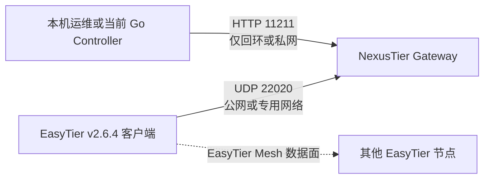

# NexusTier Gateway 当前版本专项部署指南

## 1. 文档范围

本文只部署 `nexustier-gateway 0.1.0` 当前源码和镜像，提供 Linux 单机和 Docker 两种路径。完整部署 Gateway、Controller 和 PostgreSQL 请使用[当前版本端到端部署指南](current-deployment-guide.zh-CN.md)。

本文不覆盖以下组件：

- Go Controller、PostgreSQL 摄取、持久化拓扑 API、指标保留和内嵌只读控制台（见[端到端部署指南](current-deployment-guide.zh-CN.md)）。
- Redis Pub/Sub。
- 经过认证的多租户公开 Web UI 或 REST/WebSocket API。
- IPAM、ACL 编译、SSO、SSH 或 RDP 功能。

因此，当前可部署能力是：接收原生 EasyTier v2.6.4 客户端连接、维护在线 Session、反向采集实时拓扑，并在本机提供只读 HTTP API。

## 2. 部署状态与支持边界

| 项目 | 当前状态 |
| --- | --- |
| 网关版本 | `0.1.0` |
| 当前发布提交 | `0d80c625b0984a8f067bbe9a3957dcab0ce8b35f` |
| 当前固定镜像 | `ghcr.io/wuyouowo/nexustier:sha-0d80c62` |
| 当前镜像 digest | `sha256:f13e64bf4501cd0afbea534a192aab099a6d228af1dbd3064e01ea4212500808` |
| EasyTier 协议基线 | `v2.6.4` |
| EasyTier commit | `8428a89d2dabc94c97d370ec607c6ca142473626` |
| 原生验证环境 | Debian 13 x86-64，systemd 257 |
| Rust MSRV | `1.95` |
| 原生 release 构建 | 已验证 |
| HTTP 与优雅关闭烟测 | 已验证 |
| Dockerfile | 已提供并完成静态审查 |
| Docker 镜像构建/推送/签名 | GitHub Actions Run `30737071915` 已验证 |
| Kubernetes 与多副本 HA | 当前不支持 |

原生构建得到的是动态链接 ELF。应在目标系统或不高于目标 glibc 版本的兼容构建环境中编译。不要把 Debian 13 上构建的二进制直接假定为兼容所有旧发行版。

## 3. 端口与网络拓扑



| 端口 | 协议 | 默认绑定 | 是否对公网开放 | 用途 |
| --- | --- | --- | --- | --- |
| `22020` | UDP | `0.0.0.0` | 按客户端来源策略开放 | EasyTier WebClient 控制通道 |
| `11211` | TCP | `127.0.0.1` | 禁止 | 网关只读 HTTP API |

注意：

- `22020` 是 UDP 配置服务器协议端口，不是普通 TCP 注册端口。
- 不需要为网关开放 EasyTier 数据面常用的 `11010` 等 Peer 端口。
- EasyTier Mesh 数据包不经过网关。
- API 当前没有认证层，绝不能直接暴露到互联网。

## 4. 部署前检查

推荐最低准备：

- 一台 Linux x86-64 主机。
- 可从 EasyTier 客户端访问的固定 IP 或 DNS 名称。
- UDP `22020` 的防火墙与 NAT 映射。
- 本地管理员可访问 `127.0.0.1:11211`。
- 构建阶段可访问 crates.io 与 EasyTier 固定 Git revision。

检查端口是否被占用：

```bash
ss -lunp | grep ':22020' || true
ss -lntp | grep ':11211' || true
```

检查系统架构和 glibc：

```bash
uname -m
ldd --version | head -1
```

当前 release 产物应显示为 64 位 x86-64 动态链接 ELF：

```bash
file target/release/nexustier-gateway
ldd target/release/nexustier-gateway
```

## 5. 从源码构建

### 5.1 安装构建依赖

Debian/Ubuntu：

```bash
apt-get update
apt-get install -y build-essential git libprotobuf-dev protobuf-compiler ca-certificates
protoc --version
```

`libprotobuf-dev` 提供 `prost-wkt-types` 构建脚本所需的
`google/protobuf/*.proto` 标准定义文件。

安装 Rust `1.95` 或更新版本，并确认：

```bash
rustc --version
cargo --version
```

### 5.2 获取和验证源码

```bash
git clone https://github.com/WuYouOwO/NexusTier.git
cd NexusTier
git checkout 0d80c625b0984a8f067bbe9a3957dcab0ce8b35f
git status --short
git log -3 --oneline --decorate
```

当前文档固定到 `0d80c62`。生产构建应使用经过审核的 commit，并保留其 SHA；升级时
显式替换为新的审核提交，不要在部署过程中自动跟随未知的远端最新提交。

### 5.3 执行质量检查

```bash
CARGO_BUILD_JOBS=1 cargo test --locked --workspace
CARGO_BUILD_JOBS=1 cargo clippy --locked --workspace --all-targets -- -D warnings
cargo fmt --all -- --check
```

当前源码预期 Rust 测试数量为 14 项；发布 Gateway 0.1.0 时的历史基线为 8 项。

### 5.4 构建 release

EasyTier 依赖较大。约 6 GiB 内存的机器应使用单并发构建：

```bash
CARGO_BUILD_JOBS=1 CARGO_INCREMENTAL=0 \
  cargo build --locked --release --package nexustier-gateway
```

已验证的干净 release 构建耗时约 12 分 27 秒。实际时间取决于 CPU、磁盘与依赖缓存。

记录待部署产物信息：

```bash
target/release/nexustier-gateway --version
sha256sum target/release/nexustier-gateway
file target/release/nexustier-gateway
ldd target/release/nexustier-gateway
```

SHA-256 应作为本次发布记录保存，不应把某台机器的构建哈希当作所有环境都必须复现的固定值。

## 6. 推荐部署：systemd 单机服务

systemd 是当前版本最容易审计和排障的生产部署方式。

以下命令需要 root 权限。

### 6.1 创建服务用户

```bash
useradd \
  --system \
  --create-home \
  --home-dir /var/lib/nexustier \
  --shell /usr/sbin/nologin \
  nexustier
```

如果用户已存在，跳过该命令：

```bash
getent passwd nexustier
```

### 6.2 安装版本化二进制

在仓库根目录执行：

```bash
RELEASE_ID="0.1.0-$(git rev-parse --short HEAD)"
install -d -o root -g root -m 0755 /usr/local/lib/nexustier
install -o root -g root -m 0755 \
  target/release/nexustier-gateway \
  "/usr/local/lib/nexustier/nexustier-gateway-${RELEASE_ID}"
ln -sfn \
  "/usr/local/lib/nexustier/nexustier-gateway-${RELEASE_ID}" \
  /usr/local/bin/nexustier-gateway
```

验证安装结果：

```bash
/usr/local/bin/nexustier-gateway --version
readlink -f /usr/local/bin/nexustier-gateway
```

版本化文件和固定入口软链接便于快速回滚。

### 6.3 创建环境文件

```bash
install -d -o root -g nexustier -m 0750 /etc/nexustier
cat >/etc/nexustier/gateway.env <<'EOF'
NEXUSTIER_GATEWAY_LISTEN_ADDR=0.0.0.0
NEXUSTIER_GATEWAY_LISTEN_PORT=22020
NEXUSTIER_GATEWAY_ADMISSION_TOKEN=replace-with-a-random-bootstrap-token
NEXUSTIER_GATEWAY_API_ADDR=127.0.0.1:11211
NEXUSTIER_GATEWAY_RPC_TIMEOUT_MS=5000
NEXUSTIER_GATEWAY_COLLECTION_TIMEOUT_MS=15000
NEXUSTIER_GATEWAY_MACHINE_CONCURRENCY=8
NEXUSTIER_GATEWAY_SNAPSHOT_TTL_MS=1000
RUST_LOG=info
EOF
chown root:nexustier /etc/nexustier/gateway.env
chmod 0640 /etc/nexustier/gateway.env
```

准入 Token 属于敏感启动凭据，必须限制环境文件读取权限，不得提交到仓库。它是当前共享启动凭据，不是可撤销的设备级身份。

### 6.4 创建 systemd 单元

写入 `/etc/systemd/system/nexustier-gateway.service`：

```ini
[Unit]
Description=NexusTier native EasyTier protocol gateway
Documentation=https://github.com/WuYouOwO/NexusTier
Wants=network-online.target
After=network-online.target

[Service]
Type=simple
User=nexustier
Group=nexustier
EnvironmentFile=/etc/nexustier/gateway.env
ExecStart=/usr/local/bin/nexustier-gateway
Restart=on-failure
RestartSec=3s

# Gateway 0.1.0 currently handles SIGINT for supervised graceful shutdown.
KillSignal=SIGINT
TimeoutStopSec=15s

NoNewPrivileges=true
PrivateTmp=true
PrivateDevices=true
ProtectSystem=strict
ProtectHome=true
ProtectKernelTunables=true
ProtectKernelModules=true
ProtectControlGroups=true
RestrictSUIDSGID=true
LockPersonality=true
CapabilityBoundingSet=
AmbientCapabilities=
UMask=0027
LimitNOFILE=65536

[Install]
WantedBy=multi-user.target
```

环境文件是必需配置，不能添加忽略缺失的 `-` 前缀。当前 Token 配置在程序层仍是
可选项，部署检查必须确认 `NEXUSTIER_GATEWAY_ADMISSION_TOKEN` 存在且非空；否则
Gateway 会启动但不校验共享 Token。`KillSignal=SIGINT` 是当前 `0.1.0` 的必要配置。
省略它时，systemd 默认 SIGTERM 不会进入网关的 Ctrl+C 优雅关闭分支。

检查并启用服务：

```bash
systemd-analyze verify /etc/systemd/system/nexustier-gateway.service
systemctl daemon-reload
systemctl enable --now nexustier-gateway.service
systemctl status nexustier-gateway.service --no-pager
```

应在完成服务用户和 `/usr/local/bin/nexustier-gateway` 安装后执行 `systemd-analyze verify`。如果提前验证，工具会正确报告用户或 `ExecStart` 目标不存在。

### 6.5 检查日志和监听端口

```bash
journalctl -u nexustier-gateway.service -n 100 --no-pager
ss -lunp | grep ':22020'
ss -lntp | grep ':11211'
```

预期日志包含：

```text
gateway API is listening listen_addr=127.0.0.1:11211
EasyTier gateway is listening listen_url=udp://0.0.0.0:22020
```

## 7. 防火墙与公网入口

只允许 UDP `22020` 进入网关。TCP `11211` 保持回环绑定，不添加公网放行规则。

### 7.1 nftables

将以下规则整合到现有防火墙的 input chain，不要不审查现有 ruleset 就创建第二套全局策略：

```nftables
udp dport 22020 ct state new,established counter accept comment "NexusTier EasyTier WebClient"
```

先查看当前规则：

```bash
nft list ruleset
```

如果已有 `table inet filter` 和 `chain input`，可按实际环境添加：

```bash
nft add rule inet filter input \
  udp dport 22020 \
  ct state new,established \
  counter accept \
  comment 'NexusTier EasyTier WebClient'
```

### 7.2 UFW

使用 UFW 的主机：

```bash
ufw allow 22020/udp comment 'NexusTier EasyTier WebClient'
ufw status verbose
```

### 7.3 云安全组和 NAT

- 云安全组入站仅放行 UDP `22020`。
- 有固定客户端出口 IP 时，优先限制源地址。
- 客户端来源会漫游时，可开放更宽源范围，同时应配置随机共享准入 Token。
- 网关位于 NAT 后时，将公网 UDP `22020` 映射到网关 UDP `22020`。
- DNS A/AAAA 记录应指向实际可达地址。
- 不要把 TCP `11211` 加入公网安全组。

## 8. EasyTier v2.6.4 客户端接入

EasyTier v2.6.4 已确认的参数为：

- CLI：`--config-server`，短参数 `-w`。
- 环境变量：`ET_CONFIG_SERVER`。

完整端点格式：

```text
udp://<网关主机或 IP>:22020/<非空 Token>
```

当前镜像可通过 `NEXUSTIER_GATEWAY_ADMISSION_TOKEN` 校验共享 Token，但它仍不是零信任设备凭据。

### 8.1 仅注册 Session

```bash
read -rsp 'Gateway admission token: ' GATEWAY_TOKEN && echo
export ET_CONFIG_SERVER="udp://gateway.example.com:22020/${GATEWAY_TOKEN}"
export ET_MACHINE_ID='11111111-2222-3333-4444-555555555555'
unset GATEWAY_TOKEN
easytier-core
```

`--machine-id` 应为稳定 UUID。尤其在容器或频繁重装环境中，显式设置 Machine ID 可以避免每次启动被识别为新机器。

使用环境变量：

```bash
test -n "${ET_CONFIG_SERVER:-}" && test -n "${ET_MACHINE_ID:-}"
easytier-core
```

仅指定配置服务器时，客户端可以注册 Session，但当前网关不会下发网络实例配置。因此 `/v1/topology` 可能显示机器在线但 `instances` 为空。

### 8.2 同时运行本地 EasyTier 网络实例

若要看到 Node、Peer、Route 和 Stats，客户端需要已有本地配置：

```bash
read -rsp 'Gateway admission token: ' GATEWAY_TOKEN && echo
export ET_CONFIG_SERVER="udp://gateway.example.com:22020/${GATEWAY_TOKEN}"
export ET_MACHINE_ID='11111111-2222-3333-4444-555555555555'
unset GATEWAY_TOKEN
easytier-core --config-file /etc/easytier/node.toml
```

网关将通过 WebClient 双向连接反向枚举该本地实例。数据面仍按 `/etc/easytier/node.toml` 中的 EasyTier 配置运行。

### 8.3 确认安全连接

客户端完成能力探测后会重连安全通道。网关日志应出现：

```text
EasyTier session registered ... secure=true
```

网关会忽略没有首个合法心跳的探测连接，Session Pool 只包含已注册连接。

## 9. 上线验收

### 9.1 无客户端时

进程存活检查：

```bash
curl --fail --silent --show-error http://127.0.0.1:11211/healthz
```

预期：

```json
{"status":"ok","active_sessions":0}
```

就绪检查：

```bash
curl --silent --show-error --include http://127.0.0.1:11211/readyz
```

没有客户端时预期返回 `503 Service Unavailable`，错误码为 `no_active_sessions`。这是正常状态，不应触发 systemd 重启。

### 9.2 客户端注册后

```bash
curl --fail --silent --show-error http://127.0.0.1:11211/readyz
curl --fail --silent --show-error http://127.0.0.1:11211/v1/sessions
curl --fail --silent --show-error http://127.0.0.1:11211/v1/topology
```

验收点：

- `/readyz` 返回 `200`。
- `active_sessions` 大于 `0`。
- `/v1/sessions` 中 Machine ID 与客户端一致。
- 心跳 Token 未出现在响应中。
- 有本地实例时，`/v1/topology` 包含 `node`、`peers`、`metrics` 或对应局部 `errors`。
- 日志中安全会话显示 `secure=true`。

### 9.3 验证优雅停止

```bash
systemctl stop nexustier-gateway.service
journalctl -u nexustier-gateway.service -n 30 --no-pager
```

预期日志包含 `shutdown signal received`，并在 15 秒内退出。

随后恢复：

```bash
systemctl start nexustier-gateway.service
```

网关重启后 Session Pool 为空，EasyTier 客户端会自动重连。短时间内 `/readyz` 返回 `503` 属于预期恢复过程。

## 10. Docker 部署

仓库根目录包含多阶段 `Dockerfile`。GitHub Actions 已验证镜像构建、GHCR 推送和 Cosign 签名；生产使用前仍应在预发布主机执行本节验收。

GitHub Actions 发布地址：

```text
ghcr.io/wuyouowo/nexustier
```

发布规则：

- Pull Request 只构建验证，不推送镜像。
- 推送到 `main` 后发布 `main`、`latest` 和 `sha-<短提交>` 标签。
- 推送 `v*.*.*` 版本标签后发布语义版本、主次版本和提交 SHA 标签。
- 也可以从 GitHub Actions 页面手动运行 `Build and publish container image`。
- 发布镜像使用 GitHub OIDC 与 Cosign 进行无密钥签名。
- 每次镜像构建前必须通过独立质量门禁：Rust 格式/测试/Clippy、Go test/vet、PostgreSQL 集成和 topology v1 契约资产检查。
- Pull Request 工作流只拥有只读权限且不获取 OIDC Token；包写入和签名权限仅在非 PR 发布任务启用。

拉取当前固定镜像：

```bash
docker pull ghcr.io/wuyouowo/nexustier:sha-0d80c62
docker pull \
  ghcr.io/wuyouowo/nexustier@sha256:f13e64bf4501cd0afbea534a192aab099a6d228af1dbd3064e01ea4212500808
```

安装 Cosign 后验证发布者身份：

```bash
cosign verify \
  --certificate-identity \
  'https://github.com/WuYouOwO/NexusTier/.github/workflows/docker-publish.yml@refs/heads/main' \
  --certificate-oidc-issuer 'https://token.actions.githubusercontent.com' \
  'ghcr.io/wuyouowo/nexustier@sha256:f13e64bf4501cd0afbea534a192aab099a6d228af1dbd3064e01ea4212500808'
```

### 10.1 构建镜像

```bash
docker build \
  --pull \
  --tag nexustier-gateway:0.1.0 \
  .
```

跨境依赖访问较慢时，通过临时 build arguments 传入标准代理变量，不要把代理地址写进 Dockerfile：

```bash
docker build \
  --build-arg HTTP_PROXY="${HTTP_PROXY}" \
  --build-arg HTTPS_PROXY="${HTTPS_PROXY}" \
  --build-arg ALL_PROXY="${ALL_PROXY}" \
  --tag nexustier-gateway:0.1.0 \
  .
```

### 10.2 运行容器

```bash
sudo docker run -d \
  --name nexustier-gateway \
  --restart unless-stopped \
  --init \
  --read-only \
  --tmpfs /tmp:rw,noexec,nosuid,size=16m \
  --cap-drop ALL \
  --security-opt no-new-privileges:true \
  --env-file /etc/nexustier/gateway.env \
  -p 22020:22020/udp \
  -p 127.0.0.1:11211:11211/tcp \
  ghcr.io/wuyouowo/nexustier@sha256:f13e64bf4501cd0afbea534a192aab099a6d228af1dbd3064e01ea4212500808
```

镜像内 API 绑定 `0.0.0.0:11211`，但端口发布只绑定宿主机 `127.0.0.1`。Dockerfile 声明 `STOPSIGNAL SIGINT`，`docker stop` 会进入网关优雅关闭流程。
Docker CLI 必须能读取 `/etc/nexustier/gateway.env`；root-only 文件应使用
`sudo docker run ...`，不要为方便而降低 Token 文件权限。

### 10.3 验证容器

```bash
docker ps --filter name=nexustier-gateway
docker logs --tail 100 nexustier-gateway
docker inspect \
  --format '{{json .State.Health}}' \
  nexustier-gateway
curl --fail --silent --show-error http://127.0.0.1:11211/healthz
```

停止并清理：

```bash
docker stop --time 15 nexustier-gateway
docker rm nexustier-gateway
```

## 11. 远程访问 API

当前没有认证代理。运维人员需要远程检查时，推荐使用 SSH 本地端口转发：

```bash
ssh -N \
  -L 11211:127.0.0.1:11211 \
  operator@gateway.example.com
```

然后在运维终端访问：

```bash
curl http://127.0.0.1:11211/healthz
curl http://127.0.0.1:11211/v1/topology
```

不要为了远程调试把 API 地址改为公网 `0.0.0.0:11211`。

## 12. 日常运维

### 12.1 服务状态

```bash
systemctl is-active nexustier-gateway.service
systemctl status nexustier-gateway.service --no-pager
journalctl -u nexustier-gateway.service --since '30 minutes ago' --no-pager
```

### 12.2 健康与就绪

- `/healthz` 用作进程 liveness。
- `/readyz` 用作客户端接入 readiness。
- 不要用 `/readyz` 作为 systemd 自动重启条件，因为没有客户端时 `503` 是合法状态。

### 12.3 拓扑轮询

`/v1/topology` 使用单飞采集和短期 TTL 缓存：并发请求共享一轮 RPC，TTL 内复用同一 `collection_id`。运维脚本仍应：

- 避免高频抓取。
- 使用 10 至 30 秒的轮询间隔起步，再根据节点规模、Controller 轮询和延迟调整。
- 检查机器和实例级 `errors`，不要把部分失败误判为整次采集失败。

### 12.4 日志级别

生产默认：

```text
RUST_LOG=info
```

临时排障可改为 `debug`，完成后恢复 `info`，避免长期产生大量底层 EasyTier 日志。

## 13. 升级与回滚

当前 Session 存于内存，升级重启会断开客户端；EasyTier WebClient 会自动重连。升级窗口内 `/readyz` 会短暂返回 `503`。

### 13.1 升级

构建并验证新版本后：

```bash
NEW_RELEASE_ID="0.1.0-$(git rev-parse --short HEAD)"
install -o root -g root -m 0755 \
  target/release/nexustier-gateway \
  "/usr/local/lib/nexustier/nexustier-gateway-${NEW_RELEASE_ID}"

PREVIOUS_TARGET="$(readlink -f /usr/local/bin/nexustier-gateway)"
printf '%s\n' "${PREVIOUS_TARGET}" >/var/lib/nexustier/previous-binary

ln -sfn \
  "/usr/local/lib/nexustier/nexustier-gateway-${NEW_RELEASE_ID}" \
  /usr/local/bin/nexustier-gateway

systemctl restart nexustier-gateway.service
curl --fail http://127.0.0.1:11211/healthz
```

等待客户端重连后再检查 `/readyz` 和 `/v1/topology`。

### 13.2 回滚

```bash
PREVIOUS_TARGET="$(cat /var/lib/nexustier/previous-binary)"
test -x "${PREVIOUS_TARGET}"
ln -sfn "${PREVIOUS_TARGET}" /usr/local/bin/nexustier-gateway
systemctl restart nexustier-gateway.service
curl --fail http://127.0.0.1:11211/healthz
```

保留至少一个已验证旧二进制及其 SHA-256 和源码 commit。

## 14. 数据备份与灾难恢复

当前网关没有数据库、磁盘 Session 或历史遥测文件。需要备份的内容只有：

- `/etc/nexustier/gateway.env`。
- `/etc/systemd/system/nexustier-gateway.service`。
- 已验证的版本化二进制及 SHA-256。
- 对应源码 commit 和 `Cargo.lock`。
- 主机防火墙与云安全组配置。

恢复流程：

1. 安装二进制、环境文件和 systemd 单元。
2. 恢复 UDP `22020` 网络入口。
3. 启动网关并验证 `/healthz`。
4. 等待 EasyTier 客户端自动重连。
5. 验证 `/readyz`、Session 数量和拓扑。

当前不支持会话跨主机迁移或多副本共享。不要把两个网关放在普通无状态负载均衡器后并假定它们共享 Session。高可用方案需要后续明确设计客户端归属、控制器聚合和故障切换。

## 15. 安全加固清单

- API 保持回环或可信私有网络绑定。
- 公网只开放 UDP `22020`。
- 有固定来源时限制客户端源 IP。
- 使用非 root 用户运行。
- systemd 清空 capabilities，启用只读系统保护。
- Docker 使用非 root 用户、只读根文件系统、`cap-drop ALL` 和 `no-new-privileges`。
- 不在仓库、镜像或环境文件中硬编码代理、私钥和未来数据库凭据。
- 当前部署应配置随机共享准入 Token，但不能用它替代后续设备级身份认证。
- 定期审查 EasyTier 固定 revision，不静默切换上游分支。
- 对外宣称能力时区分当前已实现网关与 README 路线图。

## 16. 常见故障

| 现象 | 可能原因 | 处理 |
| --- | --- | --- |
| 启动时报端口占用 | 已有进程监听 `22020` 或 `11211` | 使用 `ss` 查找占用，停止冲突服务或调整配置 |
| `protoc` not found | 缺少构建依赖 | 安装 `protobuf-compiler` |
| 客户端无法连接 | UDP 防火墙、NAT、DNS 或参数错误 | 检查 `22020/udp`、抓取日志、确认完整 `udp://` URL |
| 日志只有能力探测，没有 Session | 客户端未完成安全重连或首个心跳 | 检查客户端版本与日志，确认 v2.6.4 |
| `/readyz` 返回 `503` | 没有已注册 Session | 启动客户端；若刚重启则等待自动重连 |
| Session 在线但实例为空 | 客户端没有本地 EasyTier 实例 | 同时提供 EasyTier `--config-file` 或其他本地实例配置 |
| 拓扑实例出现 `errors` | 某个反向 RPC 超时或实例停止 | 查看 `operation`、`message` 和客户端状态 |
| systemd 停止超时 | 单元未使用 SIGINT 或任务未回收 | 确认 `KillSignal=SIGINT`、`TimeoutStopSec=15s` |
| Docker 停止不优雅 | 使用了未更新镜像 | 确认镜像包含 `STOPSIGNAL SIGINT`，重新构建 |
| release 构建内存过高 | Cargo 并发过多 | 使用 `CARGO_BUILD_JOBS=1 CARGO_INCREMENTAL=0` |
| 旧 Linux 无法运行二进制 | glibc 版本不兼容 | 在目标兼容发行版构建，或使用经验证的容器镜像 |

## 17. 上线检查表

部署前：

- [ ] 源码 commit 和 `Cargo.lock` 已冻结。
- [ ] 当前源码 14 项 Rust 测试全部通过。
- [ ] Clippy `-D warnings` 通过。
- [ ] release 二进制版本、SHA-256、架构和动态依赖已记录。
- [ ] UDP `22020` 的 DNS、NAT、防火墙和安全组已配置。
- [ ] TCP `11211` 未对公网开放。
- [ ] systemd 使用 `KillSignal=SIGINT`，或容器镜像声明 `STOPSIGNAL SIGINT`。

上线后：

- [ ] `/healthz` 返回 `200`。
- [ ] 客户端日志显示配置服务器连接成功。
- [ ] 网关日志显示 `secure=true` Session。
- [ ] `/readyz` 在客户端接入后返回 `200`。
- [ ] `/v1/sessions` 不包含 Token。
- [ ] `/v1/topology` 返回实例数据或可解释的局部错误。
- [ ] 停止测试能在 15 秒内优雅退出。
- [ ] 升级回滚目标和恢复步骤已记录。

## 18. 相关文档

- [中文文档索引](README.md)
- [当前版本端到端部署指南](current-deployment-guide.zh-CN.md)
- [当前版本用户教程](current-usage-guide.zh-CN.md)
- [Gateway 当前版本专项使用指南](usage-guide.zh-CN.md)
- [Rust 网关使用与 API 手册](gateway-guide.zh-CN.md)
- [Rust 网关源码架构解析](gateway-code.zh-CN.md)
- [Go 控制器运行与边界说明](../controller/README.md)
- [Go 控制器源码架构解析](controller-code.zh-CN.md)
- [智能体工程交接文档](AGENT_HANDOFF.md)
- [英文网关说明](../crates/nexustier-gateway/README.md)
