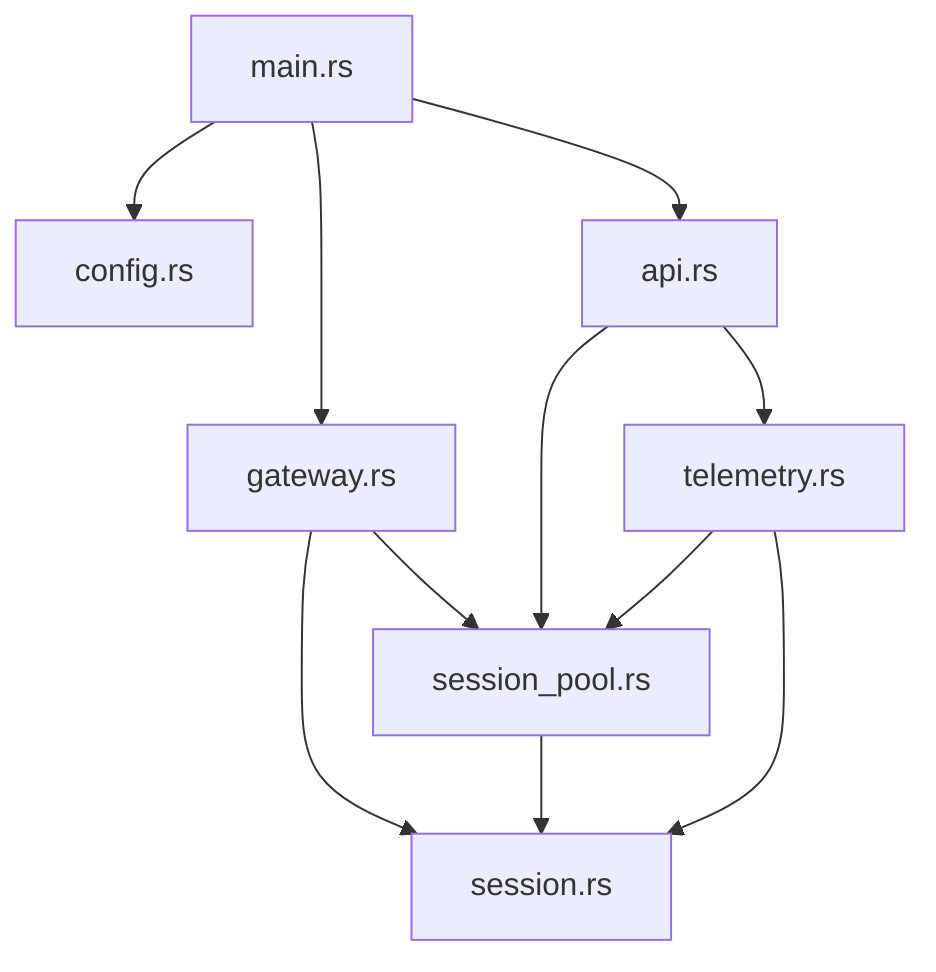

# Rust 网关源码架构解析

当前完整栈部署见[端到端部署指南](current-deployment-guide.zh-CN.md)，节点接入和
状态查看见[用户教程](current-usage-guide.zh-CN.md)。

## 1. 设计目标

网关源码围绕四个约束组织：

1. **兼容原生客户端**：直接复用 EasyTier v2.6.4 的 Tunnel、双向 RPC 和 Protobuf 类型，不自行仿造私有协议。
2. **控制面与数据面分离**：网关只处理配置与管理 RPC，数据包仍由 EasyTier 节点互传。
3. **向 Go 提供稳定契约**：HTTP 层输出 NexusTier 自有 DTO，不暴露 EasyTier 生成的 Protobuf 结构。
4. **局部故障隔离**：一台机器或一个实例的 RPC 失败不会阻断其他拓扑数据。

## 2. 源码目录

```text
crates/nexustier-gateway/src/
├── main.rs          进程入口、服务监督和优雅关闭
├── config.rs        CLI 与环境变量配置
├── gateway.rs       UDP 监听、加密协商和 Session 生命周期
├── session.rs       EasyTier 双向 RPC 会话与心跳状态
├── session_pool.rs  Machine ID 并发索引与重连替换
├── telemetry.rs     反向 RPC、拓扑聚合和 NexusTier DTO
└── api.rs           Axum 只读 HTTP API 与错误格式
```

依赖关系保持单向：



## 3. `main.rs`：双服务监督器

入口完成以下步骤：

1. 初始化 `tracing_subscriber`，默认日志级别为 `info`。
2. 通过 Clap 解析 `GatewayConfig`。
3. 创建 `Gateway`，取得它共享的 `SessionPool`。
4. 用同一个 Session Pool 创建 `ApiState` 和 `TelemetryCollector`。
5. 分别启动 UDP 网关任务和 HTTP API 任务。
6. 等待 Ctrl+C、UDP 服务退出或 HTTP 服务退出中的任一事件。
7. 广播关闭信号，并最多等待 10 秒完成优雅回收。

`flatten_task_result()` 把 Tokio task panic、服务内部错误和正常完成统一为 `anyhow::Result<()>`。任一关键服务异常退出都会成为进程退出原因，避免出现“HTTP 还活着但 UDP 已停止”的假健康状态。

## 4. `config.rs`：配置入口

`GatewayConfig` 同时支持 CLI 参数和环境变量。类型使用 `IpAddr`、`SocketAddr` 和 `u16`，非法地址或越界端口会在启动前由 Clap 拒绝，而不是推迟到监听阶段。

默认设计体现了安全边界：

- EasyTier 入口绑定 `0.0.0.0:22020`，允许外部客户端接入。
- 可选共享准入 Token 默认未配置，便于兼容开发环境；生产部署应显式配置。
- 管理 API 绑定 `127.0.0.1:11211`，默认不对外暴露。
- 每个 EasyTier 反向 RPC 默认有 5 秒 deadline。

## 5. `gateway.rs`：接入和生命周期

### 5.1 UDP 接受循环

`Gateway::serve()` 调用 EasyTier 的 `UdpTunnelListener`，在 `tokio::select!` 中同时处理：

- 新 Tunnel。
- 已结束的 Session task。
- 进程关闭通知。

每个连接使用独立 task，单个恶意或异常客户端不能阻塞后续连接接受。

### 5.2 安全协商

`accept_session()` 先调用 EasyTier 的 `accept_or_upgrade_server_tunnel()`。该函数识别普通能力探测连接和 Noise 安全握手，并返回最终 Tunnel 及 `secure` 标志。

服务端允许明文能力探测，但拒绝明文心跳。只有 Noise + AES-GCM 安全重连收到首个合法心跳后才把 Session 放入 Pool。能力探测连接通常不会发送心跳，它关闭后会在约 100 ms 内被识别和回收，最长首心跳等待时间为 15 秒。

### 5.3 注册与断开

首个心跳产生 `SessionSnapshot`，其中 Machine ID 是稳定索引。注册过程：

```text
Tunnel -> GatewaySession -> 首个 Heartbeat -> Machine ID -> SessionPool
```

如果同一 Machine ID 已有 Session，新 Session 原子替换旧 Session，并主动停止旧 RPC manager。这适用于 NAT 映射变化、网络切换和客户端重启。

连接结束时调用 `remove_if_current()`，只允许当前 Session 删除自己。旧连接晚到的断开事件无法误删已经替换它的新 Session。

## 6. `session.rs`：双向 RPC 桥

### 6.1 `BidirectRpcManager`

每个 `GatewaySession` 拥有一个 EasyTier `BidirectRpcManager`。同一 Tunnel 同时承载两个方向：

- 客户端调用网关注册的 `WebServerService`。
- 网关调用客户端注册的 `WebClientService`、`PeerManageRpc` 和 `StatsRpc`。

因此不需要客户端额外开放管理端口，也不需要网关连接客户端 NAT 后的地址。

### 6.2 心跳服务

`GatewayRpcService` 实现 EasyTier `WebServerService`：

- `get_feature()` 告诉客户端网关支持安全配置通道。
- `heartbeat()` 要求安全通道，校验 Machine ID 和可选共享准入 Token，并固定首个心跳的 Machine ID；通过后更新最后心跳和客户端元数据。

Session 状态放在 `Arc<RwLock<SessionState>>` 中：心跳写入频率低，HTTP 快照读取可并发进行。`watch` channel 只用于通知首个心跳到达，不承担历史消息队列职责。

### 6.3 反向客户端工厂

以下方法都从同一个 RPC manager 创建作用域客户端：

- `management_client()`：枚举客户端网络实例。
- `peer_client()`：获取 Node、Peer 和 Route。
- `stats_client()`：获取实例指标。

这些 trait object 留在协议层内部。上层遥测模块收到 Protobuf 后立即转换，不把它们放入 HTTP public contract。

## 7. `session_pool.rs`：并发会话索引

Pool 的核心类型是：

```rust
DashMap<Uuid, Arc<GatewaySession>>
```

选择 `DashMap` 是因为接入、断开和 HTTP 查询可能来自不同 Tokio task。选择 `Arc<GatewaySession>` 是因为 RPC manager 本身提供内部并发控制，不需要在整个 Session 外再套一层异步互斥锁。

`remove_if_current()` 使用 `Arc::ptr_eq()` 比较对象身份，而不只比较 Machine ID：

```text
旧 Session A 注册 -> 新 Session B 替换 A -> A 迟到的断开事件
                                           -> 指针不等，不删除 B
```

对应单元测试 `stale_disconnect_cannot_remove_a_replacement_session` 锁定了这个竞态条件。

## 8. `telemetry.rs`：遥测聚合

### 8.1 两级采集

遥测按两级组织：

1. 并发遍历所有 Machine Session。
2. 每台机器先调用 `list_network_instance()`，再逐实例采集。

不同机器通过 `JoinSet` 并发，但只维持配置的最大机器并发数；完成一台后才从待处理队列补入下一台。单台机器内的实例当前顺序采集，以限制客户端 RPC 压力；单个实例的四类 RPC 使用 `tokio::join!` 并行：

```text
show_node_info ─┐
list_peer ──────┼─> InstanceTopology
list_route ─────┤
get_stats ──────┘
```

每个 RPC 单独套 `tokio::time::timeout()`。超时或 RPC 错误通过 `rpc_value()` 转换为 `TelemetryError`，其他成功字段仍然返回。

`TelemetryCollector` 的共享状态还实现了单飞与短期缓存：首个请求启动后台采集，并发请求通过 `watch` 等待同一结果；TTL 内直接复用已完成快照。整轮采集使用独立总期限，到期后中止未完成任务、保留已完成机器，并增加快照级 `collection_timeout` 错误。

### 8.2 DTO 解耦

公共响应使用以下 NexusTier 类型：

- `SessionView`
- `TopologySnapshot`
- `MachineTopology`
- `InstanceTopology`
- `NodeView`
- `PeerView`
- `MetricView`
- `TelemetryError`

这样做避免 Go 控制器和前端依赖 EasyTier Protobuf 字段。未来升级 EasyTier 时，只需修改 Rust 转换层，并保持 HTTP JSON 契约稳定。

`TopologySnapshot` 当前固定声明 `nexustier.topology.v1`，包含一次采集的 UUID、开始/完成时间和快照级错误；Machine 与 Instance 各自携带 `observed_at_ms`。`TelemetryError.code` 区分 Session 不可用、RPC 错误、RPC 超时和采集任务失败，控制器不需要解析错误消息文本。

仓库 `contracts/` 中的 JSON Schema 是跨语言规范，固定 fixture 同时由 Rust 生产者和后续 Go 消费者测试。任何字段删除、改名或类型收窄都必须显式升级契约版本。

### 8.3 Peer 与 Route 合并

`list_peer()` 返回连接级统计，`list_route()` 返回目标节点和下一跳。`join_peers_and_routes()` 以 `peer_id` 合并二者：

- 直连 Peer：RTT 来自默认连接；没有默认连接时取可用连接的最小时延。
- 中继 Peer：延迟使用 Route 的路径延迟。
- 收发字节：汇总该 Peer 的全部连接。
- 丢包率：优先使用默认连接。
- 隧道协议：去重汇总连接的 Tunnel 类型。

转换结果按 `peer_id` 排序，机器和实例也按 UUID 排序，从而让 API 输出稳定，便于测试、缓存和差异比较。

## 9. `api.rs`：HTTP 边界

Axum Router 只暴露四个 GET 端点。`ApiState` 同时持有 Session Pool 和 TelemetryCollector：

- `/healthz` 只检查进程服务，不要求客户端在线。
- `/readyz` 要求至少有一个已注册 Session。
- `/v1/sessions` 只读取心跳快照，不执行反向 RPC。
- `/v1/topology` 触发实时反向遥测。

未知路由和就绪失败使用统一错误 envelope：

```json
{
  "error": {
    "code": "stable_machine_code",
    "message": "human readable message"
  }
}
```

稳定的 `code` 供 Go 控制器判断，`message` 用于日志和诊断。

## 10. 防御性错误处理

| 风险 | 当前处理 |
| --- | --- |
| Tunnel 缺少远端元数据 | 拒绝当前连接并记录警告 |
| 明文连接发送心跳 | RPC 返回错误，不注册 Session |
| 心跳共享 Token 不匹配 | RPC 返回错误，不注册 Session |
| 心跳缺少 Machine ID | RPC 返回错误，不注册 Session |
| 会话内 Machine ID 改变 | RPC 返回错误，保留原身份 |
| 客户端只做能力探测 | 通道关闭后快速回收，最长 15 秒超时 |
| 同一 Machine ID 重连 | 新 Session 替换并停止旧 Session |
| 旧 Session 延迟退出 | 指针身份检查，不能删除新 Session |
| 单个 RPC 超时 | 写入实例 `errors`，保留其他数据 |
| 单台机器任务 panic | 记录错误，继续返回其他机器 |
| UDP 或 HTTP 服务异常退出 | 进程监督器关闭另一服务并返回错误 |
| 正常终止 | 广播关闭并最多等待 10 秒回收 |

## 11. 测试结构

当前测试覆盖：

- API 健康、就绪和 404 错误契约。
- Session Pool 重连竞态。
- 明文心跳、错误准入 Token 和会话内 Machine ID 变化拒绝路径。
- 直连 RTT、流量、丢包字段映射。
- 中继路径延迟和下一跳字段映射。
- topology v1 固定 fixture 与 Rust 序列化结果一致。
- 并发拓扑请求共享一次采集，TTL 到期后才生成新 `collection_id`。
- 真实 EasyTier v2.6.4 WebClient 安全注册。
- 真实 no-TUN EasyTier 实例。
- 反向 `list_network_instance`、`show_node_info`、`list_peer`、`list_route` 和 `get_stats`。

集成测试使用 no-TUN 实例，因此不要求 root、TUN 或 `NET_ADMIN`，可以在普通 CI 环境运行。

## 12. 当前限制与后续演进

当前模块有意保持 MVP 边界：

- Session 仅保存在内存中，网关重启后由客户端自动重连恢复。
- HTTP API 无认证，依靠回环地址或私有网络隔离。
- `/v1/topology` 是实时采集，不提供历史数据。
- 不执行 IPAM、ACL 编译、SSO 准入或配置持久化。
- 单机网关尚未通过 Redis 同步 Session；长连接本身也不能跨进程迁移。

当前 Go Controller 已完成 topology v1 定时轮询、PostgreSQL 规范化写入、
幂等/乱序保护、局部失败保留、持久化当前拓扑查询 API、指标与原始 payload 保留，
以及内嵌只读拓扑控制台。实现说明见
[Go Controller 源码架构解析](controller-code.zh-CN.md)。

下一切片应设计 Controller HTTP 面的认证/租户边界和历史指标查询契约；Redis Pub/Sub、
多租户公开前端、ACL/IPAM 配置下发仍属于后续阶段。
