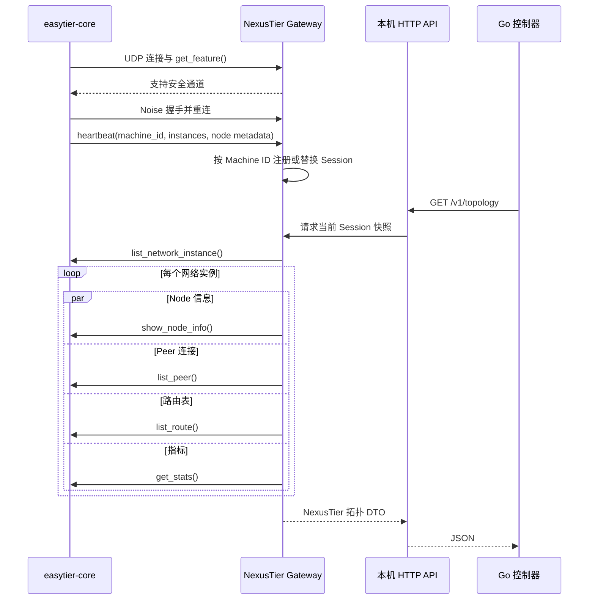

# Rust 网关使用与部署手册

本文是 Gateway API 字段参考。当前 Gateway + Controller + PostgreSQL 部署流程见
[端到端部署指南](current-deployment-guide.zh-CN.md)，常用操作见
[当前版本用户教程](current-usage-guide.zh-CN.md)。

## 1. 模块定位

`nexustier-gateway` 是 NexusTier 与原生 EasyTier 客户端之间的协议边界。它提供以下能力：

- 接收未修改的 EasyTier v2.6.4 WebClient 连接。
- 支持 Noise 握手与 AES-GCM 安全配置通道。
- 以 EasyTier Machine ID 为主键维护内存 Session Pool。
- 通过同一条双向连接反向调用 EasyTier 管理 RPC。
- 汇总 Node、Peer、Route、RTT、流量和 Stats 指标。
- 向当前 Go Controller 提供稳定、只读、与 Protobuf 解耦的 JSON API。

网关不转发 EasyTier 数据面流量，不创建 TUN 设备，也不参与 Mesh 路由计算。

## 2. 通信流程



客户端首次连接用于能力探测。双方支持安全通道时，客户端会关闭探测连接并以 Noise + AES-GCM 重连。明文连接只能调用能力探测，发送心跳会被拒绝；只有安全重连可以加入 Session Pool。

## 3. 环境要求

- Linux、Windows 或 macOS 开发环境。
- Rust `1.95` 或更新版本。
- Protobuf 编译器 `protoc` 及标准定义文件。
- 构建时可访问 crates.io 和固定的 EasyTier Git revision。

Debian/Ubuntu 安装 `protoc` 及标准定义文件：

```bash
apt-get update
apt-get install -y libprotobuf-dev protobuf-compiler
protoc --version
```

EasyTier 依赖较大。内存为 6 GiB 左右的机器建议限制 Cargo 并发：

```bash
export CARGO_BUILD_JOBS=1
export CARGO_INCREMENTAL=0
```

## 4. 本地运行

在仓库根目录执行：

```bash
cargo run --locked --package nexustier-gateway -- \
  --listen-addr 0.0.0.0 \
  --listen-port 22020 \
  --api-addr 127.0.0.1:11211 \
  --rpc-timeout-ms 5000
```

EasyTier 配置服务器端点格式：

```text
udp://<NexusTier 网关地址>:22020/<用户令牌>
```

具体配置服务器 CLI 参数以所使用的 EasyTier v2.6.4 客户端发行版为准。用户令牌会随 EasyTier 心跳进入网关，但不会出现在 `/v1/sessions` 或 `/v1/topology` 响应中。当前源码可以通过 `--admission-token` 要求所有客户端使用同一个共享准入 Token；未配置时只强制安全通道，不校验 Token 内容。

## 5. 配置项

| CLI 参数 | 环境变量 | 默认值 | 说明 |
| --- | --- | --- | --- |
| `--listen-addr` | `NEXUSTIER_GATEWAY_LISTEN_ADDR` | `0.0.0.0` | EasyTier UDP 监听地址 |
| `--listen-port` | `NEXUSTIER_GATEWAY_LISTEN_PORT` | `22020` | EasyTier UDP 监听端口 |
| `--admission-token` | `NEXUSTIER_GATEWAY_ADMISSION_TOKEN` | 未设置 | 可选的共享心跳准入 Token |
| `--api-addr` | `NEXUSTIER_GATEWAY_API_ADDR` | `127.0.0.1:11211` | Go 控制器调用的 HTTP 地址 |
| `--rpc-timeout-ms` | `NEXUSTIER_GATEWAY_RPC_TIMEOUT_MS` | `5000` | 每次反向 RPC 的独立超时 |
| `--collection-timeout-ms` | `NEXUSTIER_GATEWAY_COLLECTION_TIMEOUT_MS` | `15000` | 一次完整拓扑采集的总期限 |
| `--machine-concurrency` | `NEXUSTIER_GATEWAY_MACHINE_CONCURRENCY` | `8` | 同时采集的最大机器数，必须大于 0 |
| `--snapshot-ttl-ms` | `NEXUSTIER_GATEWAY_SNAPSHOT_TTL_MS` | `1000` | 已完成拓扑快照的复用时间，必须大于 0 |

日志通过 `RUST_LOG` 配置：

```bash
RUST_LOG=debug cargo run --locked --package nexustier-gateway
```

生产环境建议保留默认的 API 回环绑定。如果 Go 控制器和网关分别运行在容器中，应使用私有容器网络，并将 API 地址显式设置为 `0.0.0.0:11211`，不要直接暴露到公网。

## 6. HTTP API

API 当前无认证层，只允许部署在回环地址或可信私有网络。所有接口均为只读。

以下 JSON 用于说明响应结构，其中 UUID、地址、主机名、时间和指标值均为脱敏示例，不代表测试环境或真实节点。

### 6.1 `GET /healthz`

检查进程和 HTTP 服务是否存活。没有客户端连接时仍返回 `200`。

```json
{
  "status": "ok",
  "active_sessions": 0
}
```

### 6.2 `GET /readyz`

至少有一个 EasyTier Session 时返回 `200`：

```json
{
  "status": "ready",
  "active_sessions": 1
}
```

没有客户端时返回 `503 Service Unavailable`：

```json
{
  "error": {
    "code": "no_active_sessions",
    "message": "no EasyTier clients have registered"
  }
}
```

### 6.3 `GET /v1/sessions`

返回已脱敏的在线机器会话。`running_instance_ids` 来自客户端最近一次心跳。

```json
[
  {
    "machine_id": "a8846dcb-8d1d-41d9-ae90-e8d8c77a22b4",
    "remote_url": "udp://203.0.113.10:42000",
    "hostname": "edge-shanghai-01",
    "easytier_version": "2.6.4",
    "report_time": "2026-07-29T18:00:00+08:00",
    "connected_at_ms": 1785319200000,
    "last_heartbeat_at_ms": 1785319201000,
    "running_instance_ids": [
      "ac91282a-27b9-4cb7-a42f-d984663eb157"
    ],
    "device": {
      "os_type": "linux",
      "os_version": "6.12.0",
      "distribution": "Debian GNU/Linux 13"
    }
  }
]
```

### 6.4 `GET /v1/topology`

按 Machine 和 EasyTier 网络实例返回拓扑与指标：

```json
{
  "schema_version": "nexustier.topology.v1",
  "collection_id": "11111111-1111-4111-8111-111111111111",
  "started_at_ms": 1785319201000,
  "completed_at_ms": 1785319202000,
  "collected_at_ms": 1785319202000,
  "machines": [
    {
      "session": {
        "machine_id": "a8846dcb-8d1d-41d9-ae90-e8d8c77a22b4",
        "remote_url": "udp://203.0.113.10:42000",
        "hostname": "edge-shanghai-01",
        "easytier_version": "2.6.4",
        "report_time": "2026-07-29T18:00:00+08:00",
        "connected_at_ms": 1785319200000,
        "last_heartbeat_at_ms": 1785319201000,
        "running_instance_ids": [
          "ac91282a-27b9-4cb7-a42f-d984663eb157"
        ],
        "device": null
      },
      "observed_at_ms": 1785319202000,
      "instances": [
        {
          "instance_id": "ac91282a-27b9-4cb7-a42f-d984663eb157",
          "observed_at_ms": 1785319201900,
          "node": {
            "peer_id": 1001,
            "ipv4": "10.10.0.1/24",
            "hostname": "edge-shanghai-01",
            "proxy_cidrs": [],
            "listeners": ["udp://0.0.0.0:11010"],
            "version": "2.6.4"
          },
          "peers": [
            {
              "peer_id": 1002,
              "ipv4": "10.10.0.2/24",
              "hostname": "edge-beijing-01",
              "next_hop_peer_id": 1002,
              "direct": true,
              "path_cost": 1,
              "latency_ms": 18.42,
              "loss_rate": 0.001,
              "rx_bytes": 1048576,
              "tx_bytes": 524288,
              "tunnel_protocols": ["udp"],
              "version": "2.6.4"
            }
          ],
          "metrics": [
            {
              "name": "bytes_rx",
              "value": 1048576,
              "labels": {}
            }
          ],
          "errors": []
        }
      ],
      "errors": []
    }
  ],
  "errors": []
}
```

字段语义：

- `schema_version`：固定的跨语言契约版本，当前为 `nexustier.topology.v1`。
- `collection_id`：一次实际反向采集的 UUID；缓存命中时保持不变。
- `started_at_ms`、`completed_at_ms`：整次采集的开始和完成时间。
- `observed_at_ms`：当前 Machine 或 Instance 完成本轮观测的时间。
- `direct=true`：目标 Peer 为一跳直连，`latency_ms` 来自默认连接或最小时延连接的统计。
- `direct=false`：目标 Peer 经过中继，`latency_ms` 使用 EasyTier Route 的路径延迟。
- `path_cost`：EasyTier 路由代价；直连通常为 `1`。
- `next_hop_peer_id`：到目标 Peer 的下一跳。
- `loss_rate`：`0.01` 表示约 1% 丢包率。
- `rx_bytes`、`tx_bytes`：当前 Peer 所有连接的累计字节数。
- `errors`：可出现在快照、机器或实例层；`code` 用于程序判断，`operation` 和 `message` 用于定位，不代表整份快照必然失败。

并发调用 `/v1/topology` 不会启动多轮反向 RPC：请求会等待同一个进行中的采集。采集完成后的 TTL 内继续返回同一份快照和 `collection_id`。总期限到达时返回已经完成的机器，并在快照级 `errors` 中写入 `collection_timeout`。

完整机器可读定义和固定样例见 [`contracts`](../contracts/README.md)。

### 6.5 统一错误格式

不存在的路由返回 `404`：

```json
{
  "error": {
    "code": "route_not_found",
    "message": "the requested gateway API route does not exist"
  }
}
```

## 7. 容器部署

构建镜像：

```bash
docker build -t nexustier-gateway:sha-0d80c62 .
```

运行镜像：

```bash
docker run --rm \
  --name nexustier-gateway \
  -p 22020:22020/udp \
  -p 127.0.0.1:11211:11211/tcp \
  nexustier-gateway:sha-0d80c62
```

镜像特性：

- 多阶段构建，运行层不包含 Rust 工具链。
- 使用 UID `10001` 的非 root 用户。
- 不要求 TUN、`NET_ADMIN` 或其他额外 capabilities。
- 内置 `/healthz` Docker `HEALTHCHECK`。
- 构建阶段固定 `CARGO_BUILD_JOBS=1`，降低 EasyTier release 构建的峰值内存。

## 8. 验证与排障

完整验证：

```bash
cargo test --locked --workspace
cargo clippy --locked --workspace --all-targets -- -D warnings
cargo fmt --all -- --check
CARGO_BUILD_JOBS=1 CARGO_INCREMENTAL=0 \
  cargo build --locked --release --package nexustier-gateway
```

常见问题：

| 现象 | 检查项 |
| --- | --- |
| `protoc` not found 或缺少 `google/protobuf/*.proto` | 安装 `protobuf-compiler` 和 `libprotobuf-dev`，确认 `protoc --version` 可执行 |
| 客户端无法注册 | 检查 UDP `22020` 防火墙、NAT 映射和 EasyTier 配置服务器地址 |
| `/readyz` 返回 `503` | 当前没有已完成心跳注册的 EasyTier Session |
| `/v1/topology` 的实例出现 `errors` | 查看具体 `operation` 和 `message`，检查客户端实例是否仍在运行 |
| release 构建内存过高 | 设置 `CARGO_BUILD_JOBS=1` 和 `CARGO_INCREMENTAL=0` |
| Go 控制器无法访问容器 API | 确认容器内绑定 `0.0.0.0:11211`，并使用私有网络或回环端口映射 |

## 9. 安全说明

- HTTP API 不得直接暴露到互联网。
- 首个安全心跳固定当前连接的 Machine ID，后续心跳不能切换身份。
- 可选共享 Token 只是启动阶段的准入控制，不是设备级身份；完整设备授权仍由后续认证与 OIDC 入网流程负责。
- 网关响应不返回心跳中的用户令牌。
- 安全配置通道保护 EasyTier WebClient RPC 连接，但不替代 Go API 的网络隔离。
- EasyTier 数据面使用自己的加密与路由机制，网关不接触业务数据包。
